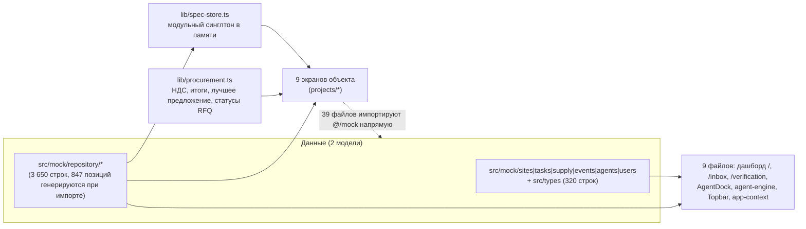
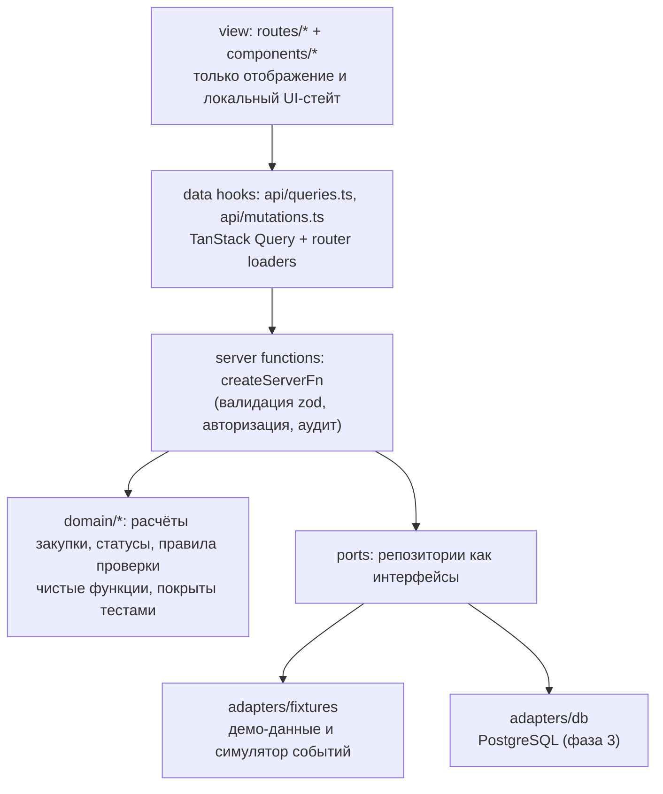

# Архитектура neeklo FieldOps

Состояние на коммит `ef7a93f`. Документ описывает, как система устроена сейчас, куда она должна прийти
и какие правила удерживают её от расползания. Решения, на которые он опирается: [ADR-001](docs/adr/ADR-001-data-layer.md),
[ADR-002](docs/adr/ADR-002-state-and-persistence.md), [ADR-003](docs/adr/ADR-003-remove-legacy-screens.md).
План работ: [TASKS.md](TASKS.md).

## 1. Что это за система

Веб-интерфейс подрядчика по навесным фасадам. Главный пользователь — руководитель проекта.
Продуктовая цепочка, вокруг которой построено всё остальное:

```
документ → извлечение позиций → проверка человеком → материалы → запрос поставщикам
        → сравнение предложений → решение → история объекта
```

Прорабы в веб не заходят: их канал — Telegram-бот, в системе видны только результаты (отчёты с площадки).

## 2. Как устроено сейчас

### 2.1 Размер кодовой базы

| Слой | Строк | Комментарий |
|---|---|---|
| `src/routes` | 7 925 | 35 файлов маршрутов, включая 13 заглушек |
| `src/components` | 11 816 | из них `components/ui` (shadcn) — 4 379 |
| `src/lib` | 1 690 | хранилище, расчёты закупки, состояния экранов, формат |
| `src/mock` | 4 482 | две независимые модели данных |

Стек: TanStack Start (SSR + серверные функции), TanStack Router с файловой маршрутизацией,
React 19, Tailwind v4, shadcn/ui. `QueryClient` создаётся в `src/router.tsx` и прокидывается провайдером,
но ни одного `useQuery`/`useMutation` в коде нет. В `src/start.ts` уже подключён CSRF-мидлвар
для серверных функций — транспорт для данных есть, он просто не используется.

### 2.2 Текущие потоки данных



### 2.3 Пять архитектурных дефектов

| № | Дефект | Где видно | Последствие |
|---|---|---|---|
| **D1** | Две параллельные модели данных и два набора типов (`src/types` + `repository/types`) | 9 файлов на старых моках; номера договоров у «Северной Короны» и «Приморского» поменяны местами между моделями | Одна величина имеет два значения: 47,2 млн / 62 % против 95,4 млн / 43,4 % |
| **D2** | Нет слоя доступа к данным: моки импортируются прямо в компоненты (39 файлов) | любой экран `projects/*`, `routes/requests.tsx` и т. д. | Подключение API = правка 39 файлов, а не одного модуля |
| **D3** | Состояние — модульный синглтон `spec-store.ts` без кеша, инвалидации и персистентности | перезагрузка страницы стирает все действия; 3 места подписаны на весь стор | Нельзя показать демо с обновлением страницы; лишние перерисовки на 847 строках |
| **D4** | Бизнес-логика и генерация данных живут в клиенте | `lib/procurement.ts` (НДС, доставка, лучшее предложение, просрочки), `repository/extraction.ts` (847 позиций строятся функцией при импорте) | Логику придётся дублировать на сервере и поддерживать в двух местах; нет серверного пейджинга |
| **D5** | Демо-механика вшита в рабочий интерфейс | `?state=`, `StatePicker` в шапке, `useSimulatedLoading` (350 мс на каждом экране), `setTimeout`-стадии загрузки, `MOCK_NOW = 05.09.2026`, 13 `PagePlaceholder` | Посторонний может выключить экран в «Нет доступа»; даты демо и реальные действия расходятся |

### 2.4 Что уже сделано хорошо и переносится в целевую архитектуру

- Единый словарь сущностей в `repository/types.ts`: сущности описаны один раз, в формате будущих ответов API.
- Экранные состояния как явный контракт (`lib/screen-state.ts`, `ScreenGate`): восемь состояний, единые тексты пустых экранов.
- Прослеживаемость: у значения есть источник (`SourceRef` → письмо, лист, голосовое сообщение) — это продуктовое ядро, его нельзя терять при миграции.
- Решения как сущность (`ProjectDecision`): требование, проблема, варианты, выбор, согласование, основание.

## 3. Целевая архитектура

Хранилище — PostgreSQL в горизонте фазы 3. Схемы `contracts` из фазы 1 сразу проектируются как задание
на его схему: ключи, связи, перечисления статусов и индексы под фильтры экранов (ADR-001, п. 8).
Старый дашборд, AI-агент и глобальные экраны `/documents`, `/requests`, `/quotes`, `/suppliers`,
`/deliveries`, `/inbox`, `/verification` из продукта удаляются (ADR-003) и возвращаются позже
только поверх единой модели.

### 3.1 Слои и зависимости



Правило направления зависимостей: `view → hooks → server functions → domain/ports`. Обратных импортов нет,
`domain` не знает про React, `view` не знает про источник данных.

### 3.2 Инварианты, которые держат архитектуру

1. **Ни один файл в `components/` и `routes/` не импортирует `@/mock/*`.** Проверяется линтом (`no-restricted-imports`).
2. **Одна сущность — одна схема.** Источник истины — `contracts/*.ts` (zod). Типы выводятся из схем, руками не пишутся.
3. **Один словарь статусов и подписей** на сущность. Сейчас словарь статусов запроса лежит в четырёх файлах, слово «Проверено» как статус — в двенадцати.
4. **Расчёты — только в `domain/`.** В компоненте не должно быть арифметики денег, сроков и «лучшего предложения».
5. **Никаких имитаций в рабочем коде.** Задержки, таймеры стадий и фиксированное «сегодня» живут только в демо-адаптере за флагом `VITE_DEMO`.
6. **Состояние экрана выводится из данных**, а не задаётся параметром адреса: `isPending`, `isError`, права роли, пустой результат.

### 3.3 Границы модулей после миграции

```
src/
  contracts/        zod-схемы и выводимые типы (единственный источник истины)
  domain/           расчёты и правила: procurement, extraction, reports
  server/           серверные функции: чтение, мутации, авторизация, аудит
  adapters/
    fixtures/       демо-данные + симулятор ответов поставщиков (флаг VITE_DEMO)
    db/             PostgreSQL: миграции и запросы (фаза 3)
  api/              query-ключи, хуки чтения и мутаций
  routes/           экраны: loader + отображение
  components/       переиспользуемые блоки; ui/ — shadcn без правок
  lib/              формат, утилиты, экранные состояния
```

## 4. Порядок миграции

Пять фаз, детали и оценки — в [TASKS.md](TASKS.md).

| Фаза | Цель | Снимает |
|---|---|---|
| 0. Демо-минимум | продукт можно показать клиенту; удалены старый дашборд, агент и глобальные экраны (ADR-003) | 10 блокеров демонстрации, часть D1 |
| 1. Контракты и модель | одна модель данных, схема PostgreSQL, порты, линт-правило | D1, D2 |
| 2. Состояние и данные | Query + серверные функции вместо синглтона | D3, частично D5 |
| 3. Логика на сервер | расчёты, пейджинг, задачи извлечения | D4 |
| 4. Роли и доступ | состояния «нет доступа» опираются на права | остаток D5 |
| 5. Качество | тесты, CI, проверка согласованности | защита от регресса |

Фазу 0 можно делать параллельно с фазой 1: она живёт внутри демо-адаптера и не конфликтует с переносом модели.

## 5. Риски

| Риск | Проявление | Что делаем |
|---|---|---|
| Синхронизация с Lovable | репозиторий связан с Lovable, ветка `main` синхронизируется, переписывать историю нельзя | миграцию ведём отдельными ветками, в `main` — только рабочее состояние; не делаем force-push |
| Нет тестов | около 53 человеко-дней правок без сетки безопасности | фаза 5 частично поднимается вперёд: тесты на расчёты закупки пишем в фазе 3, вместе с переносом |
| Демо во время миграции | показ может понадобиться в любой момент | демо-адаптер остаётся рабочим на всех фазах, это условие приёмки каждой фазы |
| Расхождение цифр вернётся | два места расчёта снова разъедутся | проверка согласованности в CI (P5-5) вместо неиспользуемой `checkConsistency()` |

## 6. Метрики готовности

| Метрика | Сейчас | Цель |
|---|---|---|
| Импортов `@/mock/*` в `components/` и `routes/` | 39 файлов | 0 |
| Наборов типов на одну предметную область | 2 | 1 |
| Файлов на старой модели данных | 9 | 0 |
| Мест, где считается итог закупки | 1 в клиенте | 1 в `domain/`, покрыто тестами |
| Словарей статуса запроса | 4 | 1 |
| Сквозной сценарий проходится без обрыва | нет (рвётся на предложениях) | да |
| Состояние выживает перезагрузку | нет | да |
| Автотесты | отсутствуют | расчёты + сквозной путь в CI |
