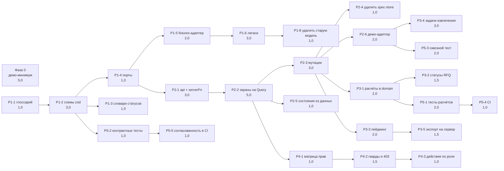

# План работ

База: коммит `ef7a93f`, результаты аудита от 16.09.2026. Решения: [ADR-001](docs/adr/ADR-001-data-layer.md),
[ADR-002](docs/adr/ADR-002-state-and-persistence.md), карта системы: [ARCHITECTURE.md](ARCHITECTURE.md).

Оценки — в человеко-днях (ч/д) для одного разработчика, знакомого с кодовой базой. «Зависит от» —
жёсткие зависимости: задачу нельзя начать раньше. Всё, что не связано зависимостью, параллелится.

## Сводка

| Фаза | Цель | Оценка | Можно начать |
|---|---|---|---|
| 0 | Демо-минимум: продукт можно показать постороннему | 5,0 ч/д | сразу |
| 1 | Контракты и единая модель данных (ADR-001) | 12,5 ч/д | сразу, параллельно фазе 0 |
| 2 | Состояние и данные через Query (ADR-002) | 15,0 ч/д | после P1-4 |
| 3 | Логика и тяжёлые операции на сервере | 10,0 ч/д | после P2-3 |
| 4 | Роли и доступ | 3,5 ч/д | после P2-2 |
| 5 | Тесты, CI, проверка согласованности | 7,0 ч/д | частично со фазы 3 |
| | **Итого** | **53,0 ч/д** | ≈ 11 недель одним разработчиком, ≈ 5–6 недель двумя |

**Критический путь:** P1-1 → P1-2 → P1-4 → P2-1 → P2-2 → P2-3 → P3-1 → P5-1 → P5-4 — 21,0 ч/д.
Столько же даёт ветка P2-3 → P2-6 → P3-4. То есть при двух разработчиках нижняя граница срока —
около пяти недель: дальше упирается не в объём, а в последовательность.
Фаза 0 в критический путь не входит и может делаться параллельно другим человеком.

## Фаза 0. Демо-минимум — 5,0 ч/д

Цель: закрыть десять блокеров демонстрации, не меняя архитектуру. Всё делается внутри текущего
хранилища и текущих экранов, чтобы результат не пришлось выбрасывать при миграции: логика симулятора
переезжает в демо-адаптер (P2-6) почти без правок.

| ID | Задача | Оценка | Зависит от | Закрывает | Готово, когда |
|---|---|---|---|---|---|
| P0-1 | Симулятор ответа поставщика: через 6–10 с после отправки запроса приходят 1–2 предложения с ценами, сроком, доступным объёмом и письмом-источником | 1,5 | — | блокер 1 | путь «создал запрос → пришли предложения → зафиксировал решение → увидел в истории» проходится на созданном запросе |
| P0-2 | «Добавить объект» действительно создаёт объект (реестр, карточка, пустые состояния внутри) | 0,5 | — | блокер 2 | после создания объект в реестре, его карточка открывается, разделы показывают пустые состояния с подсказками |
| P0-3 | Сохранение демо-состояния в `sessionStorage` + кнопка «Начать демо заново» | 0,5 | — | блокер 4 | перезагрузка страницы не теряет подтверждённые позиции, созданные запросы и решения |
| P0-4 | `StatePicker` и обработка `?state=` только при `VITE_DEMO=1` | 0,25 | — | блокер 6 | в обычной сборке переключателя нет, `?state=error` игнорируется |
| P0-5 | Убрать из меню разделы-заглушки, скрыть тупиковые ссылки в карточке («Ход работ», «Команда») | 0,5 | — | блокеры 5, 7 | из меню и карточки нельзя попасть на `PagePlaceholder` |
| P0-6 | Старые экраны (`/`, `/inbox`, `/verification`, `/documents`, `/requests`, `/quotes`, `/suppliers`, `/deliveries`) закрыть от навигации на время миграции | 0,5 | P0-5 | блокеры 3, 7, 8 | гость не может попасть на экраны со старой моделью и кнопками без обработчика |
| P0-7 | Честные подписи: «отправить в закупку» описывает то, что делает; убрать «ссылка скопирована», «в Telegram ушёл вопрос», «напоминание отправлено» либо реализовать | 0,5 | — | честность | ни одно уведомление не сообщает о действии, которого не было |
| P0-8 | Единое имя продукта в заголовках, README и дашборде | 0,25 | — | блокер 9 | во всех заголовках одно название |
| P0-9 | Горизонтальная прокрутка на `/documents` при 375 px | 0,25 | P0-6 (или правка, если экран остаётся) | блокер 10 | на 375 px нет выхода за край |
| P0-10 | Прогон демо-сценария на 1440 и 375 px, короткий сценарий показа в `docs/demo-script.md` | 0,25 | P0-1…P0-9 | — | сценарий проходится без обрывов, записан по шагам |

## Фаза 1. Контракты и единая модель — 12,5 ч/д (ADR-001)

| ID | Задача | Оценка | Зависит от | Закрывает | Готово, когда |
|---|---|---|---|---|---|
| P1-1 | Глоссарий сущностей и величин: что такое «позиция», «проверено», «в закупке», где источник каждой цифры | 1,0 | — | D1 | согласованный список сущностей и их полей, зафиксированы расхождения старой и новой модели |
| P1-2 | Схемы zod в `src/contracts/*` на все сущности, типы через `z.infer` | 3,0 | P1-1 | D1 | типы предметной области не пишутся руками; схемы покрывают все поля экранов |
| P1-3 | Единые словари статусов и подписей рядом со схемами (сейчас статус запроса дублируется в 4 файлах) | 1,0 | P1-2 | D1 | в коде один словарь на сущность, экраны читают его |
| P1-4 | Порты репозиториев: интерфейсы чтения и мутаций по областям (`projects`, `documents`, `positions`, `procurement`, `reports`, `timeline`) | 1,0 | P1-2 | D2 | интерфейсы описаны схемами, реализаций пока нет |
| P1-5 | `adapters/fixtures`: текущие моки приведены к схемам, генератор 847 позиций вынесен туда | 2,0 | P1-4 | D2, D4 | фикстуры валидируются схемами; экраны работают через порт, а не импорт мока |
| P1-6 | Решение по девяти легаси-файлам: дашборд, `/inbox`, `/verification`, агент, `Topbar`, `app-context` — перевести на новую модель или удалить | 3,0 | P1-5 | D1 | ни один файл не импортирует `@/mock/sites|tasks|supply|events|agents|users` |
| P1-7 | Линт-правило `no-restricted-imports`: `@/mock/*` и `@/adapters/*` запрещены в `components/**` и `routes/**` | 0,5 | P1-5 | D2 | нарушение правила валит `bun run lint` |
| P1-8 | Удалить `src/types/index.ts` и старую модель моков | 1,0 | P1-6, P1-7 | D1 | один набор типов на предметную область |

## Фаза 2. Состояние и данные — 15,0 ч/д (ADR-002)

| ID | Задача | Оценка | Зависит от | Закрывает | Готово, когда |
|---|---|---|---|---|---|
| P2-1 | `src/api`: таблица query-ключей, серверные функции `createServerFn` поверх портов, валидация вход/выход | 3,0 | P1-4 | D2, D3 | чтение данных идёт через серверные функции, ключи описаны в одном файле |
| P2-2 | Перевести девять экранов объекта на `loader` + `useQuery` | 5,0 | P2-1 | D3 | экраны не читают хранилище напрямую; SSR отдаёт готовые данные |
| P2-3 | Мутации: подтверждение и правка позиций, загрузка документа, создание запроса, решение, приёмка отчёта — с оптимистичным обновлением, инвалидацией и обратной мутацией для «Отменить» | 3,0 | P2-2 | D3 | после действия обновляются только затронутые запросы; «Отменить» работает через мутацию |
| P2-4 | Удалить `lib/spec-store.ts`, оставить клиентским только UI-состояние | 1,0 | P2-3 | D3 | подписок на весь стор нет, файл удалён |
| P2-5 | Состояния экрана из данных: `isPending`, `isError`, пусто, отфильтровано; удалить `useSimulatedLoading` | 1,0 | P2-2 | D5 | скелетон появляется только при реальной загрузке; восемь состояний сохранены |
| P2-6 | Демо-адаптер: seed, единые «часы демо», симулятор событий (ответы поставщиков, стадии распознавания, поставки), персистентность и сброс | 2,0 | P2-3, P0-1 | D5 | демо-режим включается флагом; в рабочем коде нет `setTimeout`-имитаций и `MOCK_NOW` |

## Фаза 3. Логика и тяжёлые операции на сервере — 10,0 ч/д

| ID | Задача | Оценка | Зависит от | Закрывает | Готово, когда |
|---|---|---|---|---|---|
| P3-1 | Перенести расчёты закупки (доставка, НДС, итог колонки, лучшее предложение, отклонения) из `lib/procurement.ts` в `domain/procurement` | 2,0 | P2-3 | D4 | в компонентах нет арифметики денег; расчёт вызывается и на сервере, и в демо-адаптере |
| P3-2 | Статусы запроса и просрочки — серверные поля, а не вычисление в клиенте от зашитой даты | 1,5 | P3-1 | D4, D5 | статус приходит с сервера; «просрочено» считается от серверного времени |
| P3-3 | Серверный пейджинг и фильтрация позиций (847+ строк), убрать клиентские `limit` и «Показать ещё» на клиентском срезе | 2,0 | P2-3 | D4 | реестр материалов и список позиций грузятся страницами |
| P3-4 | Извлечение как задача со статусом (`queued → recognizing → extracted → review`), интерфейс опрашивает статус | 3,0 | P2-6 | D4, D5 | стадии приходят от сервера; демо-адаптер эмулирует те же переходы |
| P3-5 | Экспорт Excel на сервере (сейчас собирается в браузере) | 1,5 | P3-3 | D4 | выгрузка реестра не зависит от размера данных в памяти вкладки |

## Фаза 4. Роли и доступ — 3,5 ч/д

| ID | Задача | Оценка | Зависит от | Готово, когда |
|---|---|---|---|---|
| P4-1 | Модель ролей (руководитель проекта, ПТО, снабжение, прораб, финансы, ГД) и матрица доступа по разделам и действиям | 1,0 | P2-2 | матрица согласована и описана в `docs/` |
| P4-2 | Гварды маршрутов и ответ 403 от серверных функций; экран «нет доступа» получает данные о роли | 1,5 | P4-1 | доступ проверяется на сервере, а не только в интерфейсе |
| P4-3 | Действия по роли: прораб не принимает свой отчёт, снабжение не фиксирует решение без согласования | 1,0 | P4-2 | недоступные действия скрыты или заблокированы с объяснением |

## Фаза 5. Тесты, CI, согласованность — 7,0 ч/д

| ID | Задача | Оценка | Зависит от | Готово, когда |
|---|---|---|---|---|
| P5-1 | Vitest и тесты расчётов: итоги с НДС и доставкой, выбор лучшего предложения, статусы, агрегаты спецификации | 2,0 | P3-1 | расчёты покрыты тестами, включая случай «предложены не все позиции» |
| P5-2 | Контрактные тесты: фикстуры и ответы серверных функций валидируются схемами | 1,0 | P1-2 | несовпадение схемы и данных валит тесты |
| P5-3 | Сквозной тест Playwright по цепочке документ → позиции → закупка → решение → история на демо-адаптере | 2,0 | P2-6 | тест проходит в CI и ловит обрыв цепочки |
| P5-4 | CI: `tsc --noEmit`, `eslint`, тесты на каждый пуш | 1,0 | P5-1 | ветка не сливается с падающими проверками |
| P5-5 | Проверка согласованности данных в CI вместо неиспользуемой `checkConsistency()`: сумма позиций против потребности материала, проверено + непроверено = всего, закрытое + незакрытое = выполненное | 1,0 | P5-2 | расхождение величин между экранами ломает сборку |

## Соответствие дефектам и блокерам

| Дефект из аудита | Закрывают задачи |
|---|---|
| D1. Две модели данных и типов | P1-1, P1-2, P1-3, P1-6, P1-8 |
| D2. Нет слоя доступа к данным | P1-4, P1-5, P1-7, P2-1 |
| D3. Синглтон состояния без персистентности | P2-1, P2-2, P2-3, P2-4 (демо-обход: P0-3) |
| D4. Логика и генерация данных в клиенте | P1-5, P3-1, P3-2, P3-3, P3-4, P3-5 |
| D5. Демо-механика в продукте | P0-4, P2-5, P2-6, P3-2, P3-4 |

| Блокер демонстрации | Закрывает |
|---|---|
| 1. Цепочка рвётся на предложениях поставщиков | P0-1 (демо), P2-6 + P3-2 (по-настоящему) |
| 2. «Добавить объект» не создаёт объект | P0-2 |
| 3. Разные цифры по одному объекту | P0-6 (скрыть), P1-6 + P1-8 (устранить) |
| 4. Перезагрузка стирает всё | P0-3, затем P2-1…P2-3 |
| 5. Тупики-заглушки в один клик из меню | P0-5 |
| 6. Переключатель состояний на виду | P0-4 |
| 7. Кнопки без обработчика на старых экранах | P0-6, P1-6 |
| 8. 9 позиций против 847 в глобальной документации | P0-6, P1-5 |
| 9. Разные имена продукта | P0-8 |
| 10. `/documents` уезжает за край на 375 px | P0-9 |

## Порядок и параллельность

1. **Неделя 1.** Фаза 0 целиком (один человек) + P1-1, P1-2 (второй человек). После этого продукт
   можно показывать, а модель данных описана.
2. **Недели 2–3.** P1-3…P1-8. Легаси-файлы (P1-6) — самая рискованная задача фазы: решение
   «переписать или удалить» принимается по каждому экрану отдельно.
3. **Недели 4–6.** Фаза 2. P2-2 удобно делить по экранам между двумя разработчиками после P2-1.
4. **Недели 7–8.** Фаза 3 и параллельно фаза 4 (после P2-2) — они почти не пересекаются по файлам.
5. **Недели 9–11.** Фаза 5; P5-1 и P5-2 начинаются раньше, вместе с соответствующими задачами.

## Риски плана

| Риск | Влияние | Что делаем |
|---|---|---|
| P1-6 окажется больше 3 ч/д: дашборд и агент тянут старую модель целиком | +3–5 ч/д к фазе 1 | заранее решить, остаются ли дашборд и агент в продукте; если нет — удаление вместо переписывания |
| Нет схемы реального хранилища | фаза 3 упирается в неизвестность | схемы `contracts` из P1-2 становятся заданием на схему БД; до неё работает `adapters/fixtures` |
| Синхронизация с Lovable | миграция в `main` ломает рабочее состояние в редакторе | работаем ветками, в `main` сливаем только рабочие состояния, историю не переписываем |
| Правки без тестов | регресс в цепочке, которую только что починили | P5-3 поднимается сразу после P2-6, до фазы 3 |
