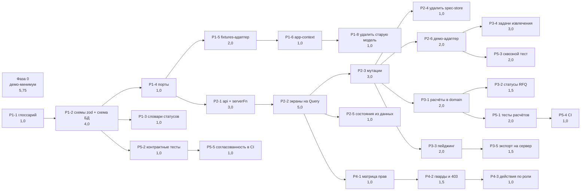

# План работ

База: коммит `ef7a93f`, результаты аудита от 16.09.2026. Решения: [ADR-001](docs/adr/ADR-001-data-layer.md),
[ADR-002](docs/adr/ADR-002-state-and-persistence.md), карта системы: [ARCHITECTURE.md](ARCHITECTURE.md).

Решения по объёму: [ADR-003](docs/adr/ADR-003-remove-legacy-screens.md) — старый дашборд, AI-агент и глобальные экраны
удаляются; хранилище — PostgreSQL в горизонте фазы 3, контракты фазы 1 пишутся как задание на его схему.

Оценки — в человеко-днях (ч/д) для одного разработчика, знакомого с кодовой базой. «Зависит от» —
жёсткие зависимости: задачу нельзя начать раньше. Всё, что не связано зависимостью, параллелится.

## Статус

| Фаза | Состояние                                                                                                                                                       |
| ---- | --------------------------------------------------------------------------------------------------------------------------------------------------------------- |
| 0    | Выполнена: `fe8bbf3` в `main`                                                                                                                                   |
| 1    | Выполнена: `71c505d` в `main`, см. «Итоги фазы 1» ниже                                                                                                          |
| 2    | Выполнена: в `main` после независимой проверки, P2-1…P2-6, см. «Итоги фазы 2» ниже                                                                              |
| 3    | Выполнена: в `main` после независимой проверки (3 круга), P3-1…P3-5 и хвосты проверки фазы 2, см. «Итоги фазы 3». Адаптер PostgreSQL — ADR-005, отдельная ветка |
| 4–5  | Не начаты                                                                                                                                                       |

## Сводка

| Фаза | Цель                                         | Оценка        | Можно начать                                        |
| ---- | -------------------------------------------- | ------------- | --------------------------------------------------- |
| 0    | Демо-минимум: продукт можно показать клиенту | 5,75 ч/д      | сразу                                               |
| 1    | Контракты и схема PostgreSQL (ADR-001)       | 11,5 ч/д      | сразу, параллельно фазе 0                           |
| 2    | Состояние и данные через Query (ADR-002)     | 15,0 ч/д      | после P1-4                                          |
| 3    | Логика и тяжёлые операции на сервере         | 10,0 ч/д      | после P2-3                                          |
| 4    | Роли и доступ                                | 3,5 ч/д       | после P2-2                                          |
| 5    | Тесты, CI, проверка согласованности          | 7,0 ч/д       | частично со фазы 3                                  |
|      | **Итого**                                    | **52,75 ч/д** | ≈ 11 недель одним разработчиком, ≈ 5–6 недель двумя |

**Критический путь:** P1-1 → P1-2 → P1-4 → P2-1 → P2-2 → P2-3 → P3-1 → P5-1 → P5-4 — 22,0 ч/д.
Столько же даёт ветка P2-3 → P2-6 → P3-4. То есть при двух разработчиках нижняя граница срока —
около пяти недель: дальше упирается не в объём, а в последовательность.
Фаза 0 в критический путь не входит и может делаться параллельно другим человеком.

## Фаза 0. Демо-минимум — 5,75 ч/д

Цель: закрыть блокеры демонстрации к показу клиенту, не меняя архитектуру. Всё делается внутри текущего
хранилища и текущих экранов, чтобы результат не пришлось выбрасывать при миграции: логика симулятора
переезжает в демо-адаптер (P2-6) почти без правок.

| ID    | Задача                                                                                                                                                                                                                           | Оценка | Зависит от | Закрывает           | Готово, когда                                                                                                       |
| ----- | -------------------------------------------------------------------------------------------------------------------------------------------------------------------------------------------------------------------------------- | ------ | ---------- | ------------------- | ------------------------------------------------------------------------------------------------------------------- |
| P0-1  | Симулятор ответа поставщика: через несколько секунд после отправки запроса приходят предложения с ценой, доставкой, НДС, сроком, доступным объёмом и письмом-источником; «Напомнить» запрашивает ответ у молчащих поставщиков    | 1,5    | —          | блокер 1            | путь «создал запрос → пришли предложения → зафиксировал решение → увидел в истории» проходится на созданном запросе |
| P0-2  | «Добавить объект» действительно создаёт объект: реестр, карточка, выбор в шапке, пустые состояния разделов                                                                                                                       | 1,0    | —          | блокер 2            | после создания объект в реестре, карточка открывается и переживает перезагрузку                                     |
| P0-3  | Сохранение демо-состояния в `sessionStorage`, возобновление незавершённых процессов после перезагрузки, «Сбросить демо-данные»                                                                                                   | 0,5    | —          | блокер 4            | перезагрузка не теряет подтверждённые позиции, созданные объекты, запросы и решения                                 |
| P0-4  | `StatePicker` и обработка `?state=` только при `VITE_SCREEN_STATES=1`                                                                                                                                                            | 0,25   | —          | блокер 6            | в обычной сборке переключателя нет, `?state=error` игнорируется                                                     |
| P0-5  | Убрать из меню разделы-заглушки, убрать тупиковые ссылки из карточки («Ход работ», «Команда»)                                                                                                                                    | 0,5    | —          | блокер 5            | из меню и карточки нельзя попасть на `PagePlaceholder`                                                              |
| P0-6  | По ADR-003 удалить старый дашборд, агента, экраны `/documents`, `/requests`, `/quotes`, `/suppliers`, `/deliveries`, `/inbox`, `/verification` и код, служивший только им; разделы объекта без выбранного объекта ведут в реестр | 1,0    | P0-5       | блокеры 3, 7, 8, 10 | маршрутов и пунктов меню нет, поиск и нижняя навигация ведут только на экраны объекта                               |
| P0-7  | Честные действия и подписи: «передать в закупку» действительно открывает позиции для запросов; убрать уведомления о действиях, которых не было                                                                                   | 0,5    | P0-1       | честность           | ни одно уведомление не сообщает о действии, которого не было                                                        |
| P0-8  | Единое имя продукта в заголовках и манифесте                                                                                                                                                                                     | 0,25   | P0-6       | блокер 9            | во всех заголовках одно название                                                                                    |
| P0-10 | Прогон демо-сценария на 1440 и 375 px, сценарий показа в `docs/demo-script.md`                                                                                                                                                   | 0,25   | P0-1…P0-8  | —                   | сценарий проходится без обрывов, записан по шагам                                                                   |

## Фаза 1. Контракты и схема PostgreSQL — 11,5 ч/д (ADR-001)

| ID   | Задача                                                                                                                                                                                                                                              | Оценка | Зависит от | Закрывает | Готово, когда                                                                                        |
| ---- | --------------------------------------------------------------------------------------------------------------------------------------------------------------------------------------------------------------------------------------------------- | ------ | ---------- | --------- | ---------------------------------------------------------------------------------------------------- |
| P1-1 | Глоссарий сущностей и величин: что такое «позиция», «проверено», «в закупке», где источник каждой цифры                                                                                                                                             | 1,0    | —          | D1        | согласованный список сущностей и их полей, зафиксированы расхождения старой и новой модели           |
| P1-2 | Схемы zod в `src/contracts/*` как задание на схему PostgreSQL: ключи `uuid`, внешние ключи с поведением при удалении, перечисления статусов, деньги в копейках, индексы под каждый список экрана, уникальности; `docs/db/schema.md` с ER-диаграммой | 4,0    | P1-1       | D1, D4    | типы выводятся из схем; для каждой таблицы описаны связи, перечисления и индексы под фильтры экранов |
| P1-3 | Единые словари статусов и подписей рядом со схемами (сейчас статус запроса дублируется в 4 файлах)                                                                                                                                                  | 1,0    | P1-2       | D1        | в коде один словарь на сущность, экраны читают его                                                   |
| P1-4 | Порты репозиториев: интерфейсы чтения и мутаций по областям (`projects`, `documents`, `positions`, `procurement`, `reports`, `timeline`)                                                                                                            | 1,0    | P1-2       | D2        | интерфейсы описаны схемами, реализаций пока нет                                                      |
| P1-5 | `adapters/fixtures`: текущие моки приведены к схемам, генератор 847 позиций вынесен туда                                                                                                                                                            | 2,0    | P1-4       | D2, D4    | фикстуры валидируются схемами; экраны работают через порт, а не импорт мока                          |
| P1-6 | Перевести `app-context` и выбор текущего пользователя на новую модель (остальные легаси-файлы удалены в P0-6)                                                                                                                                       | 1,0    | P1-5       | D1        | ни один файл не импортирует `@/mock/sites                                                            | tasks | supply | events | users` |
| P1-7 | Линт-правило `no-restricted-imports`: `@/mock/*` и `@/adapters/*` запрещены в `components/**` и `routes/**`                                                                                                                                         | 0,5    | P1-5       | D2        | нарушение правила валит `bun run lint`                                                               |
| P1-8 | Удалить `src/types/index.ts` и старую модель моков                                                                                                                                                                                                  | 1,0    | P1-6, P1-7 | D1        | один набор типов на предметную область                                                               |

### Итоги фазы 1

Что сделано сверх формулировок задач и где результат отличается от плана:

- **P1-2.** Схема БД не пишется руками: таблицы описаны в `src/contracts` вместе с типами колонок, внешними
  ключами, индексами и проверками, а `docs/db/schema.md` (ER-диаграммы по областям) и `docs/db/schema.sql`
  генерируются `bun run db:schema`. DDL применяется на PostgreSQL 16 без ошибок: 34 таблицы,
  24 перечисления, 95 индексов, 98 внешних ключей, 37 проверок.
- **P1-5.** Фикстуры — строки таблиц (`src/adapters/fixtures`), `bun run check:fixtures` проверяет схемы,
  первичные и внешние ключи, уникальности, представления и сводки; все 2270 строк загружаются в PostgreSQL
  (`bun run db:fixtures-sql`). Формулы сводки, статуса запроса и ленты истории вынесены в `src/domain`.
  **Отличие от плана:** экраны читают не порты, а клиентское хранилище демо, стартующее со снимка адаптера
  фикстур. Порты описаны интерфейсами (P1-4), их реализации появляются вместе с серверными функциями
  в P2-1 и демо-адаптером в P2-6 — вызывать асинхронные порты из синхронного рендера до TanStack Query
  нельзя без переделки всех экранов, а это и есть фаза 2.
- **P1-5.** Карточка объекта переведена на единую модель: удалены старые `specItems`, `DocumentRecord`,
  риски, журнал аудита и подтверждения (R8–R12 из глоссария).
- **P1-5.** Счётчики реестра считаются из данных, поэтому у объектов без запросов обнулились «Запросов»
  и закупочные цифры, а «Требуют внимания» стало «3 из 5». Противоречия в старых фикстурах — глоссарий, §7.
- **P1-7.** Перед правилом импорта весь `src` отформатирован prettier отдельным коммитом: `bun run lint`
  падал на старых файлах, и нарушение правила не отличалось бы от шума. Теперь `bun run lint` проходит.
- **Не сделано в фазе 1 и не планировалось:** выбор адаптера переменной окружения (P2-1), тесты инвариантов
  в CI (P5-2, P5-5) — скрипт проверки фикстур уже есть и станет их основой.

## Фаза 2. Состояние и данные — 15,0 ч/д (ADR-002)

| ID   | Задача                                                                                                                                                                                | Оценка | Зависит от | Закрывает | Готово, когда                                                                           |
| ---- | ------------------------------------------------------------------------------------------------------------------------------------------------------------------------------------- | ------ | ---------- | --------- | --------------------------------------------------------------------------------------- |
| P2-1 | `src/api`: таблица query-ключей, серверные функции `createServerFn` поверх портов, валидация вход/выход                                                                               | 3,0    | P1-4       | D2, D3    | чтение данных идёт через серверные функции, ключи описаны в одном файле                 |
| P2-2 | Перевести девять экранов объекта на `loader` + `useQuery`                                                                                                                             | 5,0    | P2-1       | D3        | экраны не читают хранилище напрямую; SSR отдаёт готовые данные                          |
| P2-3 | Мутации: подтверждение и правка позиций, загрузка документа, создание запроса, решение, приёмка отчёта — с оптимистичным обновлением, инвалидацией и обратной мутацией для «Отменить» | 3,0    | P2-2       | D3        | после действия обновляются только затронутые запросы; «Отменить» работает через мутацию |
| P2-4 | Удалить `lib/spec-store.ts`, оставить клиентским только UI-состояние                                                                                                                  | 1,0    | P2-3       | D3        | подписок на весь стор нет, файл удалён                                                  |
| P2-5 | Состояния экрана из данных: `isPending`, `isError`, пусто, отфильтровано; удалить `useSimulatedLoading`                                                                               | 1,0    | P2-2       | D5        | скелетон появляется только при реальной загрузке; восемь состояний сохранены            |
| P2-6 | Демо-адаптер: seed, единые «часы демо», симулятор событий (ответы поставщиков, стадии распознавания, поставки), персистентность и сброс                                               | 2,0    | P2-3, P0-1 | D5        | демо-режим включается флагом; в рабочем коде нет `setTimeout`-имитаций и `MOCK_NOW`     |

### Итоги фазы 2

Что сделано сверх формулировок задач и где результат отличается от плана:

- **P2-1, ADR-004.** Демо-адаптер работает в браузере, а не за серверными функциями: на Cloudflare Workers
  состояние в памяти изолята общее для всех зрителей и пропадает при выгрузке. Экраны обращаются
  к `src/api/client.ts`, который по `VITE_DATA_SOURCE` (`demo` по умолчанию или `server`) вызывает
  адаптер во вкладке или серверные функции `src/api/functions.ts`. Серверные функции проверяют вход и выход
  схемами портов и пока работают поверх того же демо-адаптера в памяти сервера.
- **P2-2.** В демо маршруты рендерятся на клиенте (`defaultSsr: false`): сервер не знает состояние вкладки.
  В режиме `server` — полный SSR. Клиенту передаются только запросы, загруженные в `loader`: запросы,
  начатые при рендере на сервере, давали расхождение гидратации. Корневой `loader` загружает часы
  и справочники, `loader` экранов — основные данные.
- **P2-3.** «Отменить» — мутация `undoReview`: клиент называет позицию, отменяемое решение и решение до него,
  а кто проверил, когда и количество цели объединения определяет сервер. Отмена пишется в журнал позиции
  («Действие отменено»). Отмена не трогает позицию, которую успели изменить иначе; переданную в закупку, если
  отмена сделала бы её непроверенной; объединение, если количество цели уже не то, что записано в журнале при
  объединении (в том числе цель объединена дальше), — и сообщает об этом. Мутации проверки перечитывают список только после последней
  из идущих подряд — иначе быстрые подтверждения «мигали» в режиме `server`.
- **P2-5.** Ошибка загрузки показывается состоянием «Ошибка» с кнопкой «Повторить»; переход не ждёт
  повторов запроса, их делает экран.
- **P2-6.** «Часы демо» стали портом `clock.now()`: экраны берут «сейчас» через `useNow()` (`src/api/clock.ts`),
  `fmtDue` и `fmtDayTitle` принимают его аргументом. «Сегодня» фикстур — `FIXTURES_NOW` в `adapters/fixtures`;
  `MOCK_NOW` удалён. Таймеры есть только в `src/adapters/demo`.
- **P2-6.** Отложенные события симулятора (стадии распознавания, ответы поставщиков, заказ, отгрузка)
  хранятся в состоянии демо и продолжаются после перезагрузки. Добавлена цепочка после выбора поставщика:
  через несколько секунд запрос переходит в «Заказано», появляется поставка, затем она «В пути».
  Приёмку поставки симулятор не делает — это действие прораба на площадке. Заметные события показываются
  уведомлением через `useDemoEvents` в корне приложения, сам адаптер интерфейс не трогает; события,
  случившиеся до подписки (сразу после перезагрузки), адаптер отдаёт при подписке.
- **P2-4.** `lib/spec-store.ts` и `lib/demo-simulator.ts` удалены; симулятор ответа поставщика перенесён
  в `adapters/demo/replies.ts` без изменений логики.
- **Независимая проверка перед вливанием.** Найдено и исправлено: подмена полей проверки через «Отменить»
  (HIGH), нет проверки связей объекта, запроса, поставщика и согласующего в решении и запросе, нет верхней
  границы размера загружаемого файла, очередь событий демо росла на сервере, мастер запроса открывался
  без выбранных позиций при пустом кеше, уведомления о приёмке и загрузке показывались до ответа сервера.
- **Хвосты проверки, перенесены:** решение хранит «кто согласовал» из формы, но не «кто внёс» — колонка
  в `project_decisions` вместе с ролями (P4-1); ошибки портов не превращаются в коды 404/409 и детали схем
  уходят клиенту — мидлвар серверных функций (P3); в режиме `server` клиентский бандл содержит демо-адаптер —
  динамический импорт (P3-5).
- **LOW из проверки, перенесены в фазу 3 (адаптер БД):** отмена не сверяет «решение до действия» с журналом
  (только прямой вызов API); запись объединения ищется по номеру позиции, а не по id источника; вычитание
  дробного количества без округления до `numeric(14,3)`; «Вернуть на проверку» объединённой позиции
  не вычитает её количество из цели.
- **Не сделано в фазе 2 и не планировалось:** экран «нет доступа» из ответа сервера (P4-2), задачи
  распознавания со статусом на сервере (P3-4). В режиме `server` симулятор работает в памяти процесса
  разработки; на Workers отложенные события не гарантированы — для показа используется режим `demo`.

## Фаза 3. Логика и тяжёлые операции на сервере — 10,0 ч/д

| ID   | Задача                                                                                                                                 | Оценка | Зависит от | Закрывает | Готово, когда                                                                         |
| ---- | -------------------------------------------------------------------------------------------------------------------------------------- | ------ | ---------- | --------- | ------------------------------------------------------------------------------------- |
| P3-1 | Перенести расчёты закупки (доставка, НДС, итог колонки, лучшее предложение, отклонения) из `lib/procurement.ts` в `domain/procurement` | 2,0    | P2-3       | D4        | в компонентах нет арифметики денег; расчёт вызывается и на сервере, и в демо-адаптере |
| P3-2 | Статусы запроса и просрочки — серверные поля, а не вычисление в клиенте от зашитой даты                                                | 1,5    | P3-1       | D4, D5    | статус приходит с сервера; «просрочено» считается от серверного времени               |
| P3-3 | Серверный пейджинг и фильтрация позиций (847+ строк), убрать клиентские `limit` и «Показать ещё» на клиентском срезе                   | 2,0    | P2-3       | D4        | реестр материалов и список позиций грузятся страницами                                |
| P3-4 | Извлечение как задача со статусом (`queued → recognizing → extracted → review`), интерфейс опрашивает статус                           | 3,0    | P2-6       | D4, D5    | стадии приходят от сервера; демо-адаптер эмулирует те же переходы                     |
| P3-5 | Экспорт Excel на сервере (сейчас собирается в браузере)                                                                                | 1,5    | P3-3       | D4        | выгрузка реестра не зависит от размера данных в памяти вкладки                        |

### Итоги фазы 3

- **P3-1.** Сравнение предложений считает адаптер и отдаёт в карточке запроса (`comparison`, схема
  `offerComparison`). Решение о выборе поставщика — `chooseSupplier`: требование, варианты, цены и основание
  собирает сервер, от формы приходят только выбор, причина и согласующий. Импорт `@/domain` в экраны запрещён линтером.
- **P3-2.** Срок ответа по запросу — поле `replyDue` сводки (часы от времени сервера и признак просрочки);
  у готового к сравнению, решённого и заказанного запроса срока нет. `fmtDue` удалён.
- **P3-3.** Позиции приходят страницами (не больше 200 строк), фильтры и счётчики считает сервер
  (`domain/positions`, `positions.facets`). Проверка позиций: список догружается при прокрутке, по ссылке
  на позицию и клавишей J; лист документа загружает свои строки, когда виден; «Подтвердить все проверенные»
  решает сервер. Материалы: у раздела свои страницы, выделение раздела — через `positions.selection`.
  **Отличие от плана:** мастер запроса по-прежнему показывает все готовые к запросу позиции, но получает
  их страницами с фильтром на сервере — выбор «все готовые» нужен целиком.
- **P3-4.** Таблица `extraction_jobs` (контракты, схема БД, фикстуры; DDL и данные проверены на PostgreSQL 16).
  Документы опрашиваются, пока задача не завершена; по завершении перечитываются позиции и сводка.
  В режиме `server` стадии видны без событий демо. Опрос ограничен ~10 минутами на задачу.
- **P3-5.** `GET /api/export/projects` строит .xlsx на сервере по фильтру реестра; в демо тот же файл строит
  адаптер во вкладке. Проверено в сборке и в локальном рантайме Workers (`wrangler dev`).
- **Хвосты проверки фазы 2, закрыты:** ошибки портов → 404/409, неверный вход → 400 без деталей, ответ
  не по схеме → 500 с общим текстом; демо-адаптер грузится динамически и не попадает в стартовый бандл
  режима `server`; отмена сверяет «решение до действия» с журналом, пара записей объединения ищется по времени
  действия, количество округляется до `numeric(14,3)`; «Вернуть на проверку» у объединённой позиции вычитает
  её количество из цели или отказывает с причиной. У запроса с решением больше нет кнопки «Изменить решение».
- **Независимая проверка фазы 3.** Найдено и исправлено: объединённую позицию можно было исключить или
  исправить, объединять недействующие позиции, в том числе по кругу и саму с собой, — количество считалось
  дважды или терялось (BLOCKER); разъединение уменьшало количество позиции, уже переданной в закупку
  (BLOCKER); неверный вход серверной функции отдавал 500 вместо 400; задачи извлечения из фикстур опрашивались
  бесконечно; фикстуры попадали в клиентскую сборку режима `server`. Правило объединений теперь явное:
  количество цели = своё + присоединённые; у объединённой позиции и у позиции с присоединёнными нельзя менять
  количество, делить и исключать; объединять можно только действующие позиции вне закупки; разъединять нельзя,
  если цель в закупке или сама объединена дальше.
- **Перед показом.** КМ-расчёт «Короны» распознан и готов к проверке (таблиц материалов нет), ведомость
  отделки убрана из демо-набора — вечной обработки нет, цифры сценария прежние. Все девять экранов объекта
  проверены на 375 px.
- **Не сделано:** адаптер PostgreSQL (`adapters/db`, ADR-001 п. 3). В таблице фазы 3 задачи нет, и он требует
  решения, где живёт БД для Cloudflare Workers (Hyperdrive с внешним PostgreSQL, Neon, Supabase). Колонка
  «кто внёс решение» — вместе с ролями (P4-1).

## Фаза 4. Роли и доступ — 3,5 ч/д

| ID   | Задача                                                                                                             | Оценка | Зависит от | Готово, когда                                               |
| ---- | ------------------------------------------------------------------------------------------------------------------ | ------ | ---------- | ----------------------------------------------------------- |
| P4-1 | Модель ролей (руководитель проекта, ПТО, снабжение, прораб, финансы, ГД) и матрица доступа по разделам и действиям | 1,0    | P2-2       | матрица согласована и описана в `docs/`                     |
| P4-2 | Гварды маршрутов и ответ 403 от серверных функций; экран «нет доступа» получает данные о роли                      | 1,5    | P4-1       | доступ проверяется на сервере, а не только в интерфейсе     |
| P4-3 | Действия по роли: прораб не принимает свой отчёт, снабжение не фиксирует решение без согласования                  | 1,0    | P4-2       | недоступные действия скрыты или заблокированы с объяснением |

## Фаза 5. Тесты, CI, согласованность — 7,0 ч/д

| ID   | Задача                                                                                                                                                                                            | Оценка | Зависит от | Готово, когда                                                       |
| ---- | ------------------------------------------------------------------------------------------------------------------------------------------------------------------------------------------------- | ------ | ---------- | ------------------------------------------------------------------- |
| P5-1 | Vitest и тесты расчётов: итоги с НДС и доставкой, выбор лучшего предложения, статусы, агрегаты спецификации                                                                                       | 2,0    | P3-1       | расчёты покрыты тестами, включая случай «предложены не все позиции» |
| P5-2 | Контрактные тесты: фикстуры и ответы серверных функций валидируются схемами                                                                                                                       | 1,0    | P1-2       | несовпадение схемы и данных валит тесты                             |
| P5-3 | Сквозной тест Playwright по цепочке документ → позиции → закупка → решение → история на демо-адаптере                                                                                             | 2,0    | P2-6       | тест проходит в CI и ловит обрыв цепочки                            |
| P5-4 | CI: `tsc --noEmit`, `eslint`, тесты на каждый пуш                                                                                                                                                 | 1,0    | P5-1       | ветка не сливается с падающими проверками                           |
| P5-5 | Проверка согласованности данных в CI вместо неиспользуемой `checkConsistency()`: сумма позиций против потребности материала, проверено + непроверено = всего, закрытое + незакрытое = выполненное | 1,0    | P5-2       | расхождение величин между экранами ломает сборку                    |

## Соответствие дефектам и блокерам

| Дефект из аудита                           | Закрывают задачи                          |
| ------------------------------------------ | ----------------------------------------- |
| D1. Две модели данных и типов              | P0-6, P1-1, P1-2, P1-3, P1-6, P1-8        |
| D2. Нет слоя доступа к данным              | P1-4, P1-5, P1-7, P2-1                    |
| D3. Синглтон состояния без персистентности | P2-1, P2-2, P2-3, P2-4 (демо-обход: P0-3) |
| D4. Логика и генерация данных в клиенте    | P1-5, P3-1, P3-2, P3-3, P3-4, P3-5        |
| D5. Демо-механика в продукте               | P0-4, P2-5, P2-6, P3-2, P3-4              |

| Блокер демонстрации                               | Закрывает                                            |
| ------------------------------------------------- | ---------------------------------------------------- |
| 1. Цепочка рвётся на предложениях поставщиков     | P0-1 (демо), P2-6 + P3-2 (по-настоящему)             |
| 2. «Добавить объект» не создаёт объект            | P0-2                                                 |
| 3. Разные цифры по одному объекту                 | P0-6 (экраны со старой моделью удалены), P1-6 + P1-8 |
| 4. Перезагрузка стирает всё                       | P0-3, затем P2-1…P2-3                                |
| 5. Тупики-заглушки в один клик из меню            | P0-5                                                 |
| 6. Переключатель состояний на виду                | P0-4                                                 |
| 7. Кнопки без обработчика на старых экранах       | P0-6                                                 |
| 8. 9 позиций против 847 в глобальной документации | P0-6, P1-5                                           |
| 9. Разные имена продукта                          | P0-8                                                 |
| 10. `/documents` уезжает за край на 375 px        | P0-6 (экран удалён)                                  |

## Порядок и параллельность

1. **Неделя 1.** Фаза 0 целиком (один человек) — к показу клиенту + P1-1, P1-2 (второй человек). После этого продукт
   можно показывать, а схема данных под PostgreSQL описана.
2. **Недели 2–3.** P1-3…P1-8. После ADR-003 легаси в фазе 1 сводится к `app-context`, основной объём — схема и порты.
3. **Недели 4–6.** Фаза 2. P2-2 удобно делить по экранам между двумя разработчиками после P2-1.
4. **Недели 7–8.** Фаза 3 и параллельно фаза 4 (после P2-2) — они почти не пересекаются по файлам.
5. **Недели 9–11.** Фаза 5; P5-1 и P5-2 начинаются раньше, вместе с соответствующими задачами.

## Риски плана

| Риск                                                                         | Влияние                                                | Что делаем                                                                                                      |
| ---------------------------------------------------------------------------- | ------------------------------------------------------ | --------------------------------------------------------------------------------------------------------------- |
| Удалённые в P0-6 экраны понадобятся клиенту раньше, чем готова единая модель | запрос на сводку по всем объектам или агента до фазы 2 | возвращаем как новые экраны поверх портов (ADR-001), не восстанавливая старый код                               |
| Схема PostgreSQL в P1-2 окажется неполной                                    | переделка миграций в фазе 3                            | схема проверяется на реальных фильтрах экранов и объёмах: 847 позиций на документ, десятки документов на объект |
| Нет схемы реального хранилища                                                | фаза 3 упирается в неизвестность                       | схемы `contracts` из P1-2 становятся заданием на схему БД; до неё работает `adapters/fixtures`                  |
| Синхронизация с Lovable                                                      | миграция в `main` ломает рабочее состояние в редакторе | работаем ветками, в `main` сливаем только рабочие состояния, историю не переписываем                            |
| Правки без тестов                                                            | регресс в цепочке, которую только что починили         | P5-3 поднимается сразу после P2-6, до фазы 3                                                                    |

## Отложено после ревью блока A (2026-09-18)

Все находки ревью уровней BLOCKER, HIGH, MEDIUM и LOW закрыты в ветке `publish-prep`.
Отложено — то, что находками не было: работа, сознательно вынесенная за границы блока A.

| Что                                                                                                         | Оценка       | Почему отложено                                                                                                                                                                                                                           |
| ----------------------------------------------------------------------------------------------------------- | ------------ | ----------------------------------------------------------------------------------------------------------------------------------------------------------------------------------------------------------------------------------------- |
| «Назначить действие»: поручение с исполнителем и сроком из плитки внимания, отчёта и позиции                | 4 ч          | Нужна сущность поручения в модели (контракты, порт, адаптер, фикстуры). Единственный шаг сценария руководителя, который не проходит; закрывать его в блоке подготовки к публикации значит менять модель данных под сроки показа           |
| Реальные права ролей и запрет прямых переходов по адресу                                                    | 8–10 ч       | Требует сессий и серверной проверки на каждой функции. Сейчас роли меняют стартовый экран и меню, и это прямо сказано в карточке персоны и в ADR-008                                                                                      |
| Реестры по всем объектам: `/schedule`, `/zones`, `/users`, `/contracts`, `/risks`, `/settings`, `/catalogs` | ≈22 ч        | Второй заход по решению владельца: сначала показать блок A, затем строить реестры на готовых компонентах таймлайна, списка захваток и таблицы людей                                                                                       |
| `/tasks` с сущностью задач и канбаном                                                                       | 4 ч + модель | Задач, созданных вручную, в модели нет; канбан по статусам контрольных точек нарушил бы правило «статус должен меняться от действий»                                                                                                      |
| Допуски сотрудников, назначение бригады на захватку, редактирование справочников                            | 6 ч + модель | Нужны новые поля и мутации. Сейчас на их местах честные аналоги со значком «как получено» (ADR-008)                                                                                                                                       |
| Ускорение первого экрана на мобильной сети (SSR данных в демо-контуре)                                      | 6–8 ч        | Правка ADR-004: сегодня демо-контур строит данные в браузере, поэтому до первого содержимого нужно скачать и выполнить основной бандл. Замеры: FCP 3,7 с на боевом адресе. Для показа обходится тем, что ведущий открывает ссылку заранее |
| Проверка доступности в `.github/workflows`                                                                  | 5 мин        | Файл лежит в `docs/ops/uptime.yml`: у токена нет права `workflow`. Копируется вручную или после выдачи права                                                                                                                              |

## Утраченный ADR-005 и правило для ADR (2026-09-19)

**ADR-005 «Адаптер PostgreSQL» утерян.** Документ лежал в ветке `phase-3-db` вместе с реализацией,
ветку не успели запушить, и 2026-09-17 она пропала при очистке сессионного каталога. Решения
сохранились только в записях прошлой фазы: `DATABASE_DRIVER=neon|pg`, о Neon знает только
`src/adapters/db/driver.ts`, миграции через dbmate, runbook `docs/runbook/database.md`. Документ
восстанавливается в задаче Q7 очереди, до реализации адаптера.

**Восстановлен 2026-09-20** отдельным коммитом до реализации (Q7). Два дополнения тоже отдельными
коммитами: порядок строк, ключи вне `uuid`, часы; очередь записей процесса. Адаптер написан
заново в `src/adapters/db`, паритет с демо проверяет `bun run check:db`.

**Правило: ADR коммитится отдельно и сразу — до начала реализации решения, которое он описывает.**
Отдельный коммит с одним файлом ADR, затем код. Решение не должно жить только в ветке вместе
с реализацией: реализацию можно написать заново, а обоснование — нет.

Порядок очереди при нехватке времени (решение владельца): Q2, правки «подтвердил заказ» и «Рев. N»,
дефект ревизии документа, Q4, Q3, Q6, Q5, Q7, Q8.

## Найдено при выполнении очереди (2026-09-19)

| Что                                                                                                                                                                                                                                        | Оценка | Почему не сделано сразу                                                                                                                                |
| ------------------------------------------------------------------------------------------------------------------------------------------------------------------------------------------------------------------------------------------ | ------ | ------------------------------------------------------------------------------------------------------------------------------------------------------ |
| Экран проверки данных: axe — `nested-interactive` (кнопки внутри `role=option`, 100 узлов), `aria-prohibited-attr` (подпись прогресса на `div` без роли), `scrollable-region-focusable`, `landmark-unique`. Есть и на `main`, не регрессия | 2 ч    | Требует перестройки списка позиций из `listbox` в список с кнопками: затрагивает клавиатурную навигацию J/K/Enter, это отдельная аккуратная задача     |
| Подсветка шага проводки — тонкая оранжевая рамка — пока шаг не выполнен, это второй оранжевый элемент экрана. Скрипт EMBER её не считает (не учитывает `outline`)                                                                          | —      | Так задано в Q2, решение записано в ADR-010. Если нужна строгость — подсвечивать нейтральной рамкой                                                    |
| Фикстуры: у запроса З-2026/324 (sr-324) сумма строк 5 900, а сумма связанных позиций 10 716 — строки запроса собраны не из всех позиций. На остатке «заказано − поставлено» это даёт расхождение у позиций, не попавших в строки           | 1 ч    | Правка фикстур меняет цифры на показе; нужна проверка согласованности «строки запроса = сумма позиций» — внесена в Q6                                  |
| Кнопка «Отзыв» проводки на 1440 перекрывает нижний край панели поставки, когда проводка свёрнута                                                                                                                                           | 0,5 ч  | Не мешает действию: кнопки панели выше; решать вместе с раскладкой проводки                                                                            |
| Рабочий контур: загрузчики маршрутов предзагружают данные разделов, закрытых роли (например, документы для карточки объекта у прораба). Экран их не показывает, но сервер пишет 403 в журнал на каждый такой заход                         | 1,5 ч  | Загрузчику нужна роль до загрузки данных: сессию придётся положить в контекст маршрутизатора (`beforeLoad`). Отдельная правка, чтобы не смешивать с Q3 |
| Рабочий контур: две вкладки с разными ролями делят одну сессию браузера — последняя вошедшая подписывает действия обеих (ADR-012, уточнение п. 4)                                                                                          | —      | Снимается входом по паролю; для демонстрации допустимо                                                                                                 |

## Найдено тестами Q6 (2026-09-20)

Исправлено в Q6: тест написан по документированному правилу, упал — исправлен код, ожидание не менялось.

| Дефект                                                                                                                                                                                                             | Где                                                                                                |
| ------------------------------------------------------------------------------------------------------------------------------------------------------------------------------------------------------------------ | -------------------------------------------------------------------------------------------------- |
| Чек-лист приёмки не узнавал семейства материалов: в данных коды (`tile`, `wool`), правило искало русские слова. Пунктов ADR-011 §6 для облицовки, утеплителя и подконструкции не было ни в одной реальной поставке | `domain/deliveries.ts` `checklistFor`                                                              |
| Акт приёмки принимал два факта по одной строке и ни одного по другой                                                                                                                                               | `domain/deliveries.ts` `acceptanceError`                                                           |
| Доставка и НДС раскладывались по строкам с отдельным округлением: сумма долей расходилась с итогом колонки на копейки                                                                                              | `domain/procurement.ts` `compareOffers`, `spread`                                                  |
| Сравнение сроков строками: при разных поясах срок ответа считался неверно                                                                                                                                          | `domain/procurement.ts` `rfqStatus`                                                                |
| «Получено 5 предложения» — склонение в тексте решения, который остаётся в истории                                                                                                                                  | `domain/procurement.ts` `supplierDecision`                                                         |
| Реестр: объект с 25 000 непроверенных строк вставал выше объекта с просроченным ответом (общий вес вместо двух ключей)                                                                                             | `domain/registry.ts`                                                                               |
| Время считалось в UTC, а метки в данных — местные: восточнее Гринвича смена начиналась на 8 часов раньше, отклонение от графика, доля срока и «молчащие бригады» смещались                                         | `domain/time.ts` — `dashboard`, `work-progress`, `overview`, `procurement`, `extraction`           |
| Перевыполнение одной захватки закрывало отставание другой в «Выполнено объёмов» (на дашборде так уже не было)                                                                                                      | `domain/work-progress.ts` `progressMetrics`                                                        |
| Незакрытый объём показывал стадию объекта, который в оценку не вошёл                                                                                                                                               | `domain/dashboard.ts` `unclosedVolume`                                                             |
| Передачу в закупку с «Не удалось определить» и решение без причины держал только экран; прямой вызов порта проходил                                                                                                | `domain/positions.ts` `handOverError`, `domain/procurement.ts` `decisionReasonError`, демо-адаптер |
| Строки всех запросов «Северной Короны» не совпадали с суммой позиций, из которых собраны (напр., 5 900 м² против 10 716 м² у З-2026/324); сумма в тексте решения по З-2026/324 не совпадала со сравнением          | фикстуры `data/procurement.ts`, `data/timeline.ts`                                                 |
| Материалы объектов без загруженных позиций говорили «материалов пока нет, загрузите спецификацию», а карточка — «734 позиции» (R20)                                                                                | `routes/projects/$id/materials.tsx`                                                                |
| Боковая панель на ноутбуках 1024–1439 px рисовалась широкой и сжималась после монтирования: содержимое прыгало, CLS 0,33, производительность реестра 69                                                            | `hooks/use-media-query.ts`                                                                         |
| Повторный «вернуть» уже возвращённого отчёта проходил: адаптер не проверял переход статуса по таблице контракта                                                                                                    | `contracts/field.ts` `reportTransitions`, демо-адаптер                                             |
| Доступность: подпись у элемента без роли в реестре; экран проверки позиций — кнопки внутри `role=option`, полоса прогресса без роли, лист без доступа с клавиатуры                                                 | реестр, `$docId.tsx`, `PositionRow`, `SheetViewer`                                                 |

Остаётся:

| Что                                                                                    | Оценка | Почему не сделано сразу                                                          |
| -------------------------------------------------------------------------------------- | ------ | -------------------------------------------------------------------------------- |
| ADR-011 называет «в пути» строками поставки, код и его комментарий — позициями         | 0,1 ч  | Решение о формулировке ADR — не правка кода; ADR не переписываются задним числом |
| Отклонение без расхождения требует фото — ADR-011 связывает фото только с расхождением | —      | Вопрос владельцу: оставить строже или ослабить                                   |

## После Q5 — нормализация и справочники (2026-09-20)

| Что                                                                                                                                                                                                  | Оценка | Почему не сделано сразу                                                                                                         |
| ---------------------------------------------------------------------------------------------------------------------------------------------------------------------------------------------------- | ------ | ------------------------------------------------------------------------------------------------------------------------------- |
| Добавление и правка поставщика с экрана: карточка сейчас только читает                                                                                                                               | 4 ч    | ADR-014 «Что не делаем»: постановка Q5 требует карточку и подбор, ведение справочника поставщиков — отдельная задача с журналом |
| Правка дерева категорий и правил соответствия с экрана                                                                                                                                               | 3 ч    | Дерево и правила показываются; правка меняет подбор поставщиков для всех объектов — нужен журнал и проверка последствий         |
| После выравнивания фикстур в Q6 запрос З-2026/324 принят полностью: на старте демонстрации «Заказано 0», «Поставлено 51». Цифры согласованы между экранами, но сюжет «часть в пути» на старте пропал | 0,5 ч  | Решение о сюжете демо — владельцу: вернуть частичную приёмку по одной строке или оставить так                                   |

## Q8 — финальный проход (2026-09-20)

Итог и сценарий показа — [`docs/STATE.md`](docs/STATE.md), решения — ADR-015. Обход всех экранов
пяти ролей (`bun run walkthrough`) и проверки сквозных тестов нашли и исправили:

| Найдено                                                                                                                                                                                                           | Исправлено                                                                         |
| ----------------------------------------------------------------------------------------------------------------------------------------------------------------------------------------------------------------- | ---------------------------------------------------------------------------------- |
| Дашборд считал заказанный запрос З-2026/321 «заявкой без ответа» (4 вместо 3), экран закупок того же объекта — «Решение принято»                                                                                  | правило `silentRequests`; сверка в `tests/consistency`                             |
| На телефоне пометки демонстрации нет: единственная — пункт меню, а меню скрыто                                                                                                                                    | метка «Демо» в шапке каждого экрана                                                |
| Закрытое выдвижное меню держит фокус: Tab уходит в невидимые пункты                                                                                                                                               | `visibility: hidden` у закрытого меню уже `lg`                                     |
| Заголовок группы меню с текущим разделом — кнопка без действия                                                                                                                                                    | группа сворачивается всегда, при переходе раскрывается сама                        |
| Уверенность полей голосового отчёта — только цветная точка с подсказкой по наведению                                                                                                                              | метка словом, как у позиций                                                        |
| «Подробнее» в шапке экрана и «введено вручную» у источника — пояснение только по наведению                                                                                                                        | `InfoTip`: пояснение по нажатию                                                    |
| «Прикрепить файл — появится позже» у ассистента — отключённая кнопка без действия                                                                                                                                 | убрана                                                                             |
| «К следующему на проверке» в шапке отчётов видна роли без права проверять и отключена, когда проверять нечего                                                                                                     | показывается по тому же правилу, что на телефоне                                   |
| Цели меньше 44 px на телефоне: закрытие боковой панели, поле ассистента, ссылка на решение в поставке, значок источника на дашборде                                                                               | `size-11` / `min-h-11` на телефоне                                                 |
| Статус объекта, контрольной точки и изменения документации показаны, но не меняются ничем                                                                                                                         | действия с записью в истории, вторая миграция типов событий (ADR-015, п. 7)        |
| «Изменения документации без разбора» ведут в документацию, где списка изменений нет — тупик                                                                                                                       | список изменений и «Разобрано» на экране документации                              |
| «Далее» в мастере запроса и «Создать запрос» в материалах недоступны без объяснения                                                                                                                               | причина видна рядом и связана с кнопкой                                            |
| Уверенность распознавания в фикстурах не помещалась в `numeric(5,4)` (найдено паритетом Q7)                                                                                                                       | генератор округляет, `check:fixtures` проверяет точность `numeric`                 |
| Локальный `bun run ci` собирал бандл с переключателем состояний экрана: Bun подгружает `.env.development` в свой процесс, и шаг сборки получал `VITE_SCREEN_STATES=1`. В GitHub шаги отдельные, там этого не было | конвейер не передаёт шагам `VITE_*`: настройки сборки берутся из `.env.production` |

Новые проверки в конвейере: `e2e/consistency.spec.ts` (одна цифра на восьми экранах),
`e2e/honesty.spec.ts` (источник и уверенность, имитация названа), `e2e/scenario.spec.ts` (сценарий
показа), `e2e/statuses.spec.ts`, мобильные проверки на 375 в `e2e/screens.spec.ts`.

## Решения владельца по итогам очереди (2026-09-20)

Закрыто в ветке `feature/post-review` (ветвь от `feature/final-queue`):

| Что                                                                                                                                                         | Как закрыто                                                                                                               |
| ----------------------------------------------------------------------------------------------------------------------------------------------------------- | ------------------------------------------------------------------------------------------------------------------------- |
| Приёмка поставок прорабом на своих объектах: прибытие, приёмка полная и частичная, отклонение, фотофиксация. Управление поставками и создание — у снабжения | матрица ADR-012 и предикат `allow` в правиле доступа; экран делит действия по праву                                       |
| Фото при отклонении без расхождения                                                                                                                         | больше не требуется: правило приведено к ADR-011, фото обязательно только при расхождении                                 |
| Сюжет демонстрации «часть поставки в пути»                                                                                                                  | мембрана по запросу З-2026/324 уехала отдельной поставкой `dl-503` «в пути»: на старте 51 заказано, 27 в пути, 24 принято |

Отложено решением владельца:

| Что                                                                    | Оценка    | Когда                                                                                           |
| ---------------------------------------------------------------------- | --------- | ----------------------------------------------------------------------------------------------- |
| Приём ответов поставщиков и распознавание документов в рабочем контуре | от 5 дней | после обратной связи: канал и сервис выбираются по тому, что скажут снабженцы на первых показах |
| Первый запуск на настоящем Neon                                        | 1 ч       | отдельной задачей после слияния в `main`                                                        |
| Ведение поставщиков и правка дерева категорий с экрана                 | 4 ч + 3 ч | на показе не нужно, остаётся в отложенном                                                       |

## Очередь готовности к продаже (S1–S5), с 21.09.2026

Ветка `feature/sales-ready` от `main`, по коммиту на задачу. S1 определил объём S3.

| Задача                              | Состояние                                                                            |
| ----------------------------------- | ------------------------------------------------------------------------------------ |
| S1. Аудит готовности к продаже      | закрыта: `docs/audit/S1-sales-readiness.md`, оценка «можно показывать с оговорками»  |
| S2. Светлая тема                    | закрыта: ADR-017, токены, переключатель, печать, прогон экранов в обеих темах        |
| S3. Связность и загрузка документов | закрыта: ADR-018 — окно загрузки со стадиями, пометка под результатом разбора, связи |
| S4. Полный обход кликабельности     | закрыта: 5 934 нажатия в двух темах, 860 проверок на пяти ширинах, две находки       |
| S5. Справка и инструкция            | следующая                                                                            |

Найдено в S1 и закрывается в S3: пометка подготовленного результата под загруженным документом,
шаги загрузки, карточка материала, блок «Связано» на пяти сущностях, хлебные крошки происхождения.

Найдено в S1 и требует решения владельца: одно имя продукта вместо трёх, с какими системами
сравнивают на встречах, ответы на возражения «где хранятся данные» и «как это с 1С».

### Что нашёл обход S4 (22.09.2026)

| Находка                                                                                                       | Как закрыто                                                               |
| ------------------------------------------------------------------------------------------------------------- | ------------------------------------------------------------------------- |
| У прораба на экране поставок ссылка «К закупкам» вела на «Нет доступа»: раздел ему закрыт                     | ссылка и действие пустого состояния — только с правом на раздел           |
| Кнопка «Открыть» в очереди дашборда на 1440 появлялась только по наведению: на сенсорном экране её не увидеть | видна всегда приглушённой, при наведении ярче                             |
| Обход двух ролей упирался в предел теста на реестре материалов (847 позиций, у каждой своя панель)            | границы обхода экрана: 120 элементов или 8 минут, остаток назван в отчёте |

Остаётся: шесть нажатий «показать на листе» для уже выбранной позиции не двигают лист — вид уже
там. Перепроверено руками: с другой позиции та же ссылка прокручивает.

## Независимая проверка ветки (2026-09-20)

Пять проверок в отдельных сессиях: постановка и дисциплина ADR, права, паритет с базой, честность
интерфейса, домен и тесты. Отчёты — `.verify/review-q8/`. Блокирующих находок две, обе исправлены
в ветке `feature/post-review`:

| Уровень | Находка                                                                                                                                                                         | Как закрыто                                                                                                                             |
| ------- | ------------------------------------------------------------------------------------------------------------------------------------------------------------------------------- | --------------------------------------------------------------------------------------------------------------------------------------- |
| HIGH    | Карточку поставщика с контактами открывал раздел «Закупки», а справочник контрагентов с ИНН и телефонами отдавался любой сессии и предзагружался на каждом экране               | справочник сужен до имени и роли (`counterpartyRef`), карточка поставщика — только раздел «Поставщики»; негативные тесты на обе границы |
| HIGH    | Состав чек-листа приёмки держал только экран: порт сверял число пунктов, поэтому акт с выдуманными пунктами проходил, а пункты по семействам материалов можно было не проходить | `acceptanceError` получает ожидаемый чек-лист поставки и сверяет состав; адаптер считает его сам; тесты домена и порта                  |

Исправлено попутно (MEDIUM): сравнение файла выгрузки в паритете не могло упасть; замер шёл
до сравнения и менял данные; цепочка паритета выросла с 22 до 41 чтения и с 19 до 25 записей;
проверка пометки демонстрации проходила по скрытому пункту меню и подписи для диктора; на экране
поставок с открытой панелью было два оранжевых пятна; проводка писала «сценарий пройден» после
пропуска шагов; добавлены тесты на раскладку копеек, подстановку сотрудника сессии и отказ без сессии.

Повторная проверка тех же изменений (отчёт `review-post-fixes.md`) нашла два HIGH — побочный
ущерб от самих правок, оба исправлены:

| Уровень | Находка                                                                                                                                                                  | Как закрыто                                                                                      |
| ------- | ------------------------------------------------------------------------------------------------------------------------------------------------------------------------ | ------------------------------------------------------------------------------------------------ |
| HIGH    | Сужение «Поставщиков» сломало экран «Закупки» у ПТО: поставщики запрашивались безусловно, и отказ попадал в состояние экрана                                             | запрос только с правом на раздел, отказ не влияет на список запросов; сквозной тест на экран ПТО |
| HIGH    | `check:db` перестал выполнять приёмку и закрытие замечания — шаг остался со старым чек-листом, оба адаптера отказывали одинаково, и скрипт печатал «паритет подтверждён» | шаг считает чек-лист по семействам материалов поставки; сопоставленных ключей снова 25           |

Попутно во втором круге: состав чек-листа сверяется строго (лишние пункты, повторы и подменённые
подписи в акт не попадут); побайтное сравнение выгрузки заменено сравнением содержимого архива —
в .xlsx лежит время сборки, поэтому одинаковые файлы иногда различались; предикат прав работает
и для правил «любая сессия»; в глоссарии отмечено, что `dl-503` теперь другая поставка.

Третий круг проверки (отчёт `review-round3.md`) смотрел на изменения второго круга и нашёл
ещё один HIGH — он был в ветке и до правок:

| Уровень | Находка                                                                                                                                                                                                                  | Как закрыто                                                                                                                                                         |
| ------- | ------------------------------------------------------------------------------------------------------------------------------------------------------------------------------------------------------------------------ | ------------------------------------------------------------------------------------------------------------------------------------------------------------------- |
| HIGH    | Вкладки «Команда» и «Ход работ» открыты по разделу `projects`, а считают по отчётам с площадки. У снабжения раздел закрыт, список отчётов приходил пустым, и экран уверенно писал «Бригад без отчёта: 2» и «без отчётов» | `useTeam` и `useWorkProgress` знают, доступен ли раздел (`reportsKnown`); без него метрика и строки показывают «—» и подпись «Отчёты с площадки закрыты вашей роли» |

Попутно в третьем круге: `check:db` теперь отличает шаг, который обязан отказать, от шага,
который обязан пройти, — и падает, если оба адаптера одинаково отказали там, где ждали запись.
Эта проверка сразу нашла мёртвый шаг цепочки («отметить заголовком» работал по позиции,
которую забирал предыдущий шаг объединения). Сквозные тесты закрывают экран закупок у ПТО
и обе вкладки карточки объекта у снабжения.

Четвёртый круг (отчёт `review-round4.md`) смотрел только на правки третьего и нашёл два HIGH:
исправление закрыло четыре места из шести.

| Уровень | Находка                                                                                                                                                                     | Как закрыто                                                                                                                        |
| ------- | --------------------------------------------------------------------------------------------------------------------------------------------------------------------------- | ---------------------------------------------------------------------------------------------------------------------------------- |
| HIGH    | Карточка бригады писала «Отчётов от бригады не было»: значок «Без отчёта 7 дней» убрали, а подпись осталась, и бригада выглядела просто молчащей                            | карточка получила причину пропуска и пишет «Последняя захватка — из отчётов с площадки, раздел закрыт вашей роли»                  |
| HIGH    | Подсказка «Как получено значение» у той же метрики перечисляла бригады: «Бригада Назарова — отчётов не было». Механизм честности противоречил прочерку, который стоял рядом | разбор значения собирается из той же причины: перечисления нет, названа причина пропуска                                           |
| MEDIUM  | `Step.fails` в `check:db` был односторонним: шаг, помеченный как «должен отказать», никто не обязывал отказать — сторожа можно было отключить у сломанного шага             | пометка сверяется в обе стороны; проверено зондом: шаг с пометкой, который прошёл, теперь ловится                                  |
| MEDIUM  | `error` у `useTeam`/`useWorkProgress` считался, но не читался: у роли с открытым разделом упавший запрос отчётов давал тот же ложный «Бригад без отчёта: 2»                 | пропуск в отчётах различает две причины — раздел закрыт роли и запрос не прошёл, — и обе называются словами (`lib/reports-gap.ts`) |

Проверка от противного: со снятой причиной пропуска сквозной тест падает — значит, он проверяет
исправление, а не соседний текст. Ветка «запрос не прошёл» автоматическим тестом не покрыта:
в демонстрационном контуре её нечем вызвать, нужна подмена ответа порта.

Пятый круг (отчёт `review-round5.md`) проверял те же правки опытом, а не чтением: подменял ответ
порта, ломал исправление семью способами по отдельности и смотрел экраны за каждую роль.
Блокирующих находок нет. Закрыто по его находкам:

| Уровень | Находка                                                                                                                                                                                                    | Как закрыто                                                                                     |
| ------- | ---------------------------------------------------------------------------------------------------------------------------------------------------------------------------------------------------------- | ----------------------------------------------------------------------------------------------- |
| MEDIUM  | Причина «не загрузились» ставилась по упавшему запросу, а не по «данных нет»: при живом кэше экран писал «Отчёты с площадки не загрузились» и рядом показывал время последнего отчёта и ссылки на захватки | пропуск считается, только когда отчётов нет на руках (`query.data === undefined`)               |
| LOW     | Новая проверка строки захватки холостая: во всех двенадцати захватках фикстур заданы оси и этажи, ветка недостижима                                                                                        | проверка убрана; остальные шесть мест тест ловит — подтверждено поломкой каждого по отдельности |
| LOW     | `error` и `refetch` у хуков вкладок никем не читались: `error` после правки равнялся ошибке карточки, которую перехватывает загрузчик маршрута                                                             | мёртвые поля убраны                                                                             |
| LOW     | Выгрузка команды в Excel писала «—» без причины: в файле это читается как «отчётов не было»                                                                                                                | в файле стоит причина словами                                                                   |
| LOW     | Заголовок «состав и последняя захватка» обещал захватку роли, которой отчёты закрыты                                                                                                                       | заголовок обещает только состав                                                                 |

Остаётся:

| Что                                                                                                                                                                                                                    | Оценка    | Почему не сделано сразу                                          |
| ---------------------------------------------------------------------------------------------------------------------------------------------------------------------------------------------------------------------- | --------- | ---------------------------------------------------------------- |
| Первоисточник отчёта с площадки (расшифровка голоса, распознанные поля) виден ролям без раздела «Отчёты с площадки»: фрагмент открывают с пяти экранов, и простое сужение раздела сломает карточку объекта у снабжения | 1,5 ч     | Нужна фильтрация содержимого панели по роли, а не запрет вызова  |
| Отказ через обёртку прав проверен тестами у части методов; рабочий контур прав (cookie-сессия, 403 серверной функции) сквозными тестами не покрыт                                                                      | 1 ч + 2 ч | Отдельная оснастка сквозных тестов для рабочего контура          |
| `withDefaultSession` выдаёт сессию руководителя любому GET без сессии (ADR-012, п. 4)                                                                                                                                  | решение   | Снимается входом по паролю; для демонстрации допустимо           |
| Скрипт EMBER не видит градиент и `outline`: правило «один градиент» ничем не проверяется                                                                                                                               | 0,5 ч     | Требует отдельного разбора фоновых слоёв                         |
| Проверка согласованности собирает источник дашборда без очереди «Требует решения» и ленты событий                                                                                                                      | 0,5 ч     | Нужны данные очереди на уровне портов                            |
| В фикстурах нет позиции с уверенностью в диапазоне 0,6–0,7: сдвиг границы полосы проверки не заметит                                                                                                                   | 0,3 ч     | Правка фикстур меняет числа демонстрации                         |
| `check:fixtures` не проверяет объявленные в контрактах `checks` и частичные уникальные индексы со сложным условием                                                                                                     | 1 ч       | Нужен разбор SQL-условий в скрипте                               |
| Загрузчик экрана материалов заранее запрашивает документы, не спрашивая права: у прораба это штатный отказ 403 в журнале сервера                                                                                       | 0,5 ч     | Находка четвёртого круга, LOW: на экран не влияет, лишний запрос |
| Ветка «отчёты не загрузились» (запрос упал при открытом разделе) проверена только чтением кода                                                                                                                         | 1 ч       | Нужна подмена ответа порта в сквозной оснастке                   |
| Решение о трактовке времени («часы на стене», `APP_TIME_ZONE`) записано в ADR-005 после реализации в Q6                                                                                                                | —         | Исправить задним числом нельзя; учтено как нарушение правила     |
