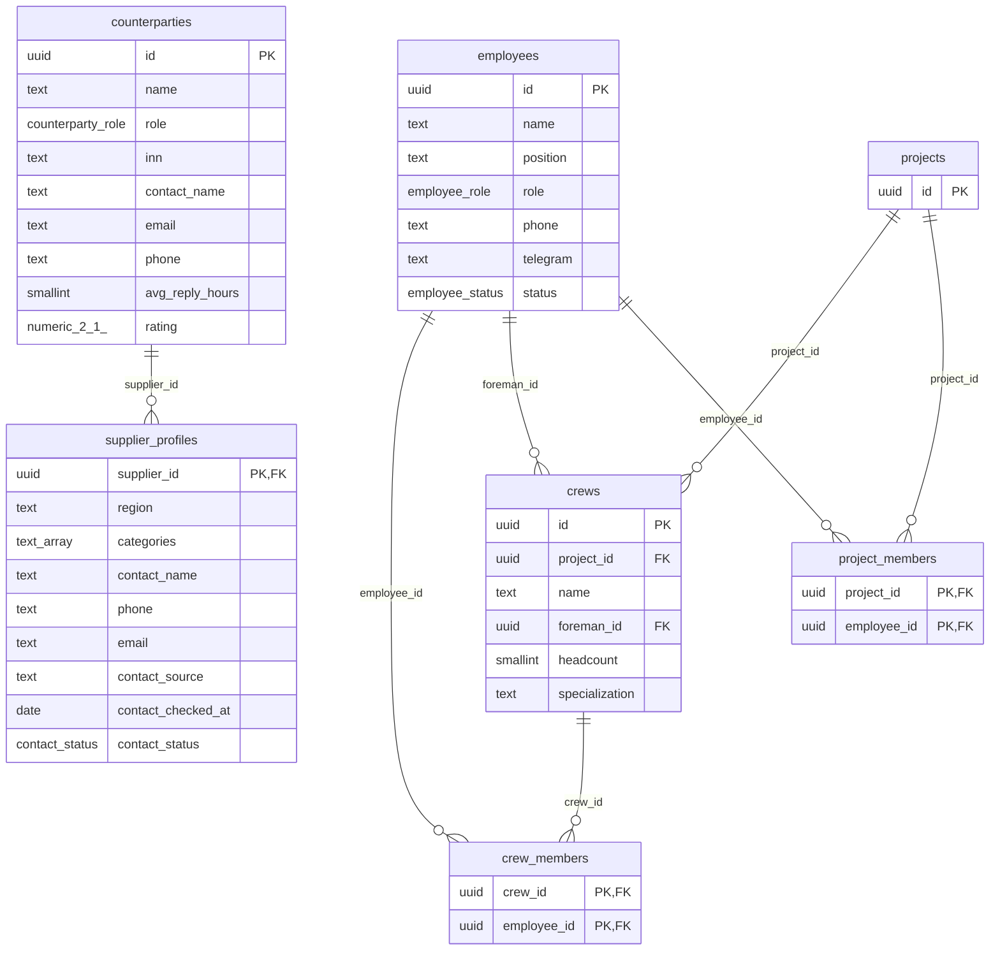
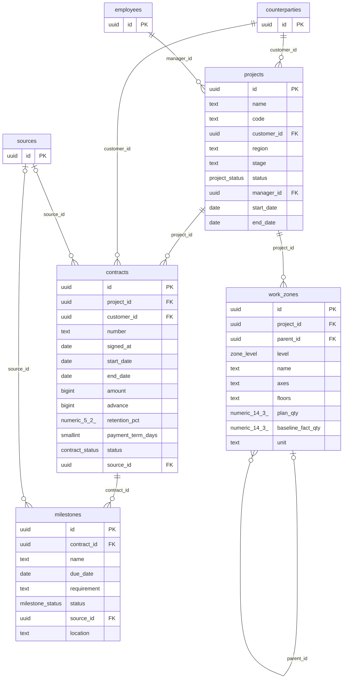
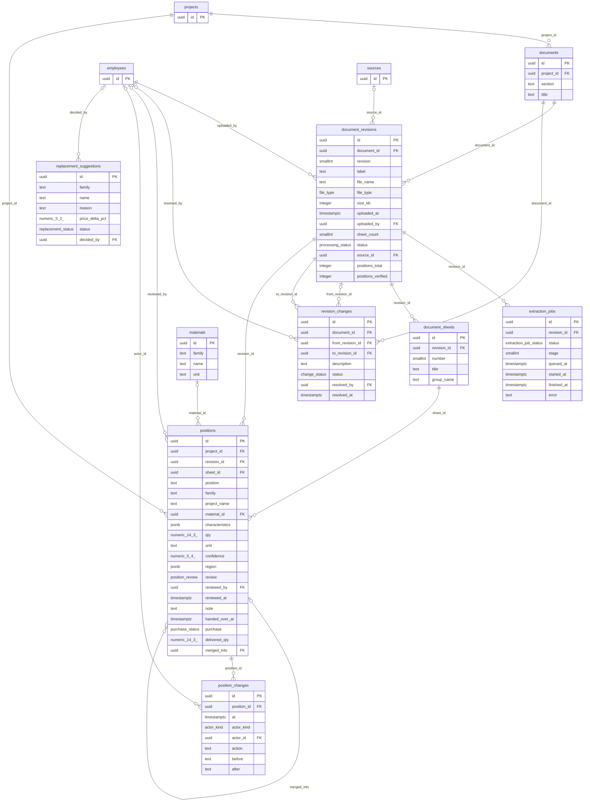
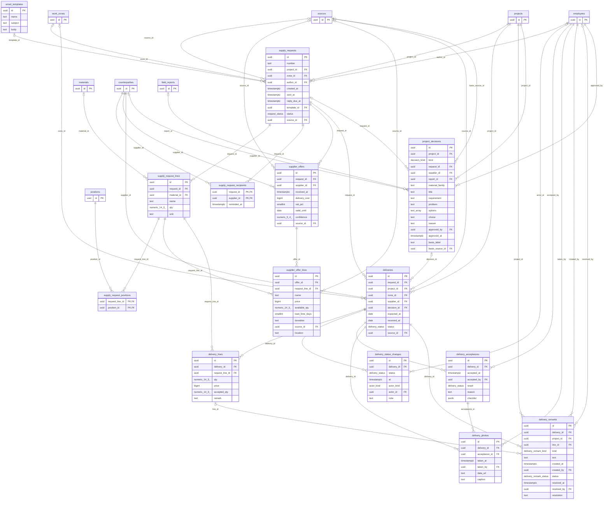
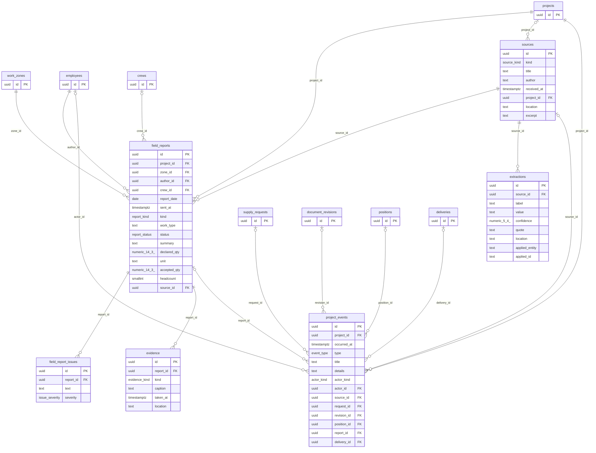

# Схема базы данных

> Сгенерировано `bun run db:schema` из `src/contracts`. Не редактировать вручную.
> DDL — [schema.sql](schema.sql). Термины и формулы — [глоссарий](../domain/glossary.md), решение — [ADR-001](../adr/ADR-001-data-layer.md).

## Соглашения

- PostgreSQL 16. Имена таблиц и колонок — `snake_case`, в TypeScript — `camelCase`.
- Первичные ключи `uuid` (`gen_random_uuid()`). Фикстуры используют читаемые ключи (`p-korona`) — адаптер БД их не принимает.
- Внешние ключи с явным `on delete`: `restrict` для всего, что служит основанием (документы, позиции, запросы, решения); `cascade` — для строк, которые не живут без родителя (листы ревизии, строки запроса и предложения, состав бригады); `set null` — для необязательных ссылок на источник.
- Деньги — `bigint` в копейках. Количества — `numeric(14,3)`. Доли и уверенность — `numeric(5,4)` от 0 до 1.
- Время — `timestamptz`, даты без времени — `date`.
- Статусы — перечисления; разрешённые переходы описаны ниже и проверяются в серверных функциях.
- Изменяемые таблицы имеют `created_at`, `updated_at`, `created_by`. Журналы (`position_changes`, `project_decisions`, `project_events`, `sources`, `extractions`) только пополняются.
- Сводка объекта (`project_overview`) — представление, а не таблица; формулы в глоссарии, §3.
- Индексы подобраны под списки и фильтры экранов; колонка «Для чего» называет экран.
- Фикстуры проверяются по этому описанию: `bun run check:fixtures` (схемы, ключи, уникальности, представления); на PostgreSQL — `psql -f docs/db/schema.sql` и `bun run db:fixtures-sql | psql`.

Таблиц: 39, перечислений: 27.

## Перечисления

| Тип                      | Значения                                                                                                                                                                                                                                                    | Переходы                                                                                                                                                                                                             | Смысл                                                                                               |
| ------------------------ | ----------------------------------------------------------------------------------------------------------------------------------------------------------------------------------------------------------------------------------------------------------- | -------------------------------------------------------------------------------------------------------------------------------------------------------------------------------------------------------------------- | --------------------------------------------------------------------------------------------------- |
| `employee_role`          | `manager`, `foreman`, `pto`, `supply`, `finance`, `worker`, `director`                                                                                                                                                                                      |                                                                                                                                                                                                                      | Роль сотрудника; от неё зависят доступные разделы и действия (фаза 4)                               |
| `employee_status`        | `active`, `vacation`, `blocked`                                                                                                                                                                                                                             |                                                                                                                                                                                                                      | Может ли сотрудник работать в системе                                                               |
| `counterparty_role`      | `customer`, `supplier`, `subcontractor`                                                                                                                                                                                                                     |                                                                                                                                                                                                                      | Роль контрагента по отношению к компании                                                            |
| `contact_status`         | `verified`, `needs_check`, `stale`                                                                                                                                                                                                                          |                                                                                                                                                                                                                      | Свежесть контакта поставщика                                                                        |
| `project_status`         | `active`, `at_risk`, `paused`, `done`                                                                                                                                                                                                                       |                                                                                                                                                                                                                      | Состояние объекта для реестра                                                                       |
| `contract_status`        | `draft`, `active`, `closed`                                                                                                                                                                                                                                 | draft → active; active → closed                                                                                                                                                                                      | Жизненный цикл договора                                                                             |
| `milestone_status`       | `planned`, `at_risk`, `done`, `overdue`                                                                                                                                                                                                                     |                                                                                                                                                                                                                      | Состояние контрольной точки договора                                                                |
| `zone_level`             | `building`, `section`, `floor`, `zone`                                                                                                                                                                                                                      |                                                                                                                                                                                                                      | Уровень участка фасада                                                                              |
| `file_type`              | `pdf`, `docx`, `xlsx`                                                                                                                                                                                                                                       |                                                                                                                                                                                                                      | Формат загруженного файла                                                                           |
| `processing_status`      | `uploaded`, `recognizing`, `extracted`, `review`, `verified`                                                                                                                                                                                                | uploaded → recognizing; recognizing → extracted; extracted → review; review → verified                                                                                                                               | Обработка ревизии: распознавание, извлечение позиций, проверка человеком                            |
| `extraction_job_status`  | `queued`, `recognizing`, `extracted`, `review`, `failed`                                                                                                                                                                                                    | queued → recognizing, failed; recognizing → extracted, failed; extracted → review, failed                                                                                                                            | Задача распознавания ревизии: очередь, распознавание, извлечение позиций, готово к проверке, ошибка |
| `change_status`          | `open`, `resolved`                                                                                                                                                                                                                                          | open → resolved                                                                                                                                                                                                      | Разобрано ли изменение документации                                                                 |
| `position_review`        | `pending`, `confirmed`, `corrected`, `excluded`, `merged`, `header`                                                                                                                                                                                         | pending → confirmed, corrected, excluded, merged, header; confirmed → pending, corrected, excluded, merged; corrected → pending, corrected, excluded, merged; excluded → pending; merged → pending; header → pending | Решение человека по извлечённой позиции                                                             |
| `purchase_status`        | `none`, `requested`, `offers`, `supplier_selected`, `ordered`, `delivered`                                                                                                                                                                                  | none → requested; requested → offers, supplier_selected; offers → supplier_selected; supplier_selected → ordered; ordered → delivered                                                                                | Этап закупки позиции; меняется событиями закупки                                                    |
| `actor_kind`             | `user`, `system`                                                                                                                                                                                                                                            |                                                                                                                                                                                                                      | Кто совершил действие: человек или обработка                                                        |
| `replacement_status`     | `proposed`, `agreed`, `rejected`                                                                                                                                                                                                                            | proposed → agreed, rejected                                                                                                                                                                                          | Решение по предложенной замене                                                                      |
| `request_status`         | `draft`, `sent`, `decided`, `ordered`, `cancelled`                                                                                                                                                                                                          | draft → sent, cancelled; sent → decided, cancelled; decided → ordered, cancelled                                                                                                                                     | Хранимый жизненный цикл запроса. Статус на экране (ждём ответы, просрочен, готов) вычисляется       |
| `delivery_status`        | `expected`, `shipped`, `in_transit`, `arrived`, `accepted`, `accepted_with_remarks`, `rejected`                                                                                                                                                             | expected → shipped, in_transit, arrived, rejected; shipped → in_transit, arrived, rejected; in_transit → arrived, rejected; arrived → accepted, accepted_with_remarks, rejected                                      | Состояние поставки: создаётся решением по запросу, закрывается актом приёмки                        |
| `delivery_remark_kind`   | `shortage`, `surplus`, `checklist`, `rejected`                                                                                                                                                                                                              |                                                                                                                                                                                                                      | Вид замечания по поставке: недостача, излишек, непройденный пункт контроля, отклонение              |
| `delivery_remark_status` | `open`, `resolved`                                                                                                                                                                                                                                          |                                                                                                                                                                                                                      | Состояние замечания                                                                                 |
| `decision_kind`          | `supplier`, `replacement`, `quantity`                                                                                                                                                                                                                       |                                                                                                                                                                                                                      | Вид зафиксированного решения                                                                        |
| `source_kind`            | `telegram`, `email`, `upload`, `call`, `manual`                                                                                                                                                                                                             |                                                                                                                                                                                                                      | Откуда пришёл первоисточник                                                                         |
| `report_kind`            | `voice`, `text`, `photo`                                                                                                                                                                                                                                    |                                                                                                                                                                                                                      | Как прислан отчёт                                                                                   |
| `report_status`          | `review`, `accepted`, `returned`                                                                                                                                                                                                                            | review → accepted, returned; returned → review, accepted; accepted → review                                                                                                                                          | Проверка отчёта руководителем или ПТО                                                               |
| `issue_severity`         | `blocker`, `warning`                                                                                                                                                                                                                                        |                                                                                                                                                                                                                      | Важность проблемы                                                                                   |
| `evidence_kind`          | `photo`, `audio`, `file`                                                                                                                                                                                                                                    |                                                                                                                                                                                                                      | Вид материала отчёта                                                                                |
| `event_type`             | `version_uploaded`, `spec_extracted`, `qty_corrected`, `request_created`, `offer_received`, `replacement_proposed`, `replacement_agreed`, `material_ordered`, `delivery_moved`, `delivery_received`, `delivery_rejected`, `delivery_remark`, `report_added` |                                                                                                                                                                                                                      | Тип события в истории объекта. Решения живут в project_decisions и в ленту добавляются при чтении   |

## Организация

#### `employees`

Сотрудники и пользователи системы.

| Колонка                                  | Тип               | Пусто | Ссылка        | Комментарий       |
| ---------------------------------------- | ----------------- | ----- | ------------- | ----------------- |
| `id` **PK**                              | `uuid`            |       |               |                   |
| `name`                                   | `text`            |       |               |                   |
| `position`                               | `text`            |       |               | должность словами |
| `role`                                   | `employee_role`   |       |               |                   |
| `phone`                                  | `text`            |       |               |                   |
| `telegram`                               | `text`            | да    |               |                   |
| `status`                                 | `employee_status` |       |               |                   |
| `created_at`, `updated_at`, `created_by` | служебные         |       | → `employees` | не отдаются в API |

| Индекс | Колонки        | Для чего                                 |
| ------ | -------------- | ---------------------------------------- |
| unique | `phone`        | вход по телефону, привязка Telegram      |
| btree  | `role, status` | выбор согласующих, прорабов и снабженцев |

#### `project_members`

Кто из сотрудников работает на объекте.

| Колонка              | Тип    | Пусто | Ссылка                   | Комментарий |
| -------------------- | ------ | ----- | ------------------------ | ----------- |
| `project_id` **PK**  | `uuid` |       | → `projects` (cascade)   |             |
| `employee_id` **PK** | `uuid` |       | → `employees` (restrict) |             |

| Индекс | Колонки       | Для чего                            |
| ------ | ------------- | ----------------------------------- |
| btree  | `employee_id` | объекты сотрудника в выборе объекта |

#### `counterparties`

Заказчики, поставщики и субподрядчики.

| Колонка                                  | Тип                 | Пусто | Ссылка        | Комментарий                                       |
| ---------------------------------------- | ------------------- | ----- | ------------- | ------------------------------------------------- |
| `id` **PK**                              | `uuid`              |       |               |                                                   |
| `name`                                   | `text`              |       |               |                                                   |
| `role`                                   | `counterparty_role` |       |               |                                                   |
| `inn`                                    | `text`              | да    |               | 10 или 12 цифр; null — контрагент ещё не проверен |
| `contact_name`                           | `text`              |       |               |                                                   |
| `email`                                  | `text`              |       |               |                                                   |
| `phone`                                  | `text`              |       |               |                                                   |
| `avg_reply_hours`                        | `smallint`          |       |               | средний срок ответа на запрос, ч                  |
| `rating`                                 | `numeric(2,1)`      |       |               | оценка 0…5                                        |
| `created_at`, `updated_at`, `created_by` | служебные           |       | → `employees` | не отдаются в API                                 |

| Индекс | Колонки                       | Для чего                                    |
| ------ | ----------------------------- | ------------------------------------------- |
| unique | `inn` where `inn is not null` | поиск и защита от дублей по ИНН             |
| btree  | `role, name`                  | списки заказчиков и поставщиков по алфавиту |

#### `supplier_profiles`

Профиль поставщика для подбора в запрос: регион, разделы спецификации, контакт.

| Колонка                                  | Тип              | Пусто | Ссылка                       | Комментарий                                   |
| ---------------------------------------- | ---------------- | ----- | ---------------------------- | --------------------------------------------- |
| `supplier_id` **PK**                     | `uuid`           |       | → `counterparties` (cascade) |                                               |
| `region`                                 | `text`           |       |                              |                                               |
| `categories`                             | `text[]`         |       |                              | разделы спецификации: Подконструкция, Крепёж… |
| `contact_name`                           | `text`           |       |                              |                                               |
| `phone`                                  | `text`           |       |                              |                                               |
| `email`                                  | `text`           |       |                              |                                               |
| `contact_source`                         | `text`           |       |                              | откуда взят контакт                           |
| `contact_checked_at`                     | `date`           |       |                              |                                               |
| `contact_status`                         | `contact_status` |       |                              |                                               |
| `created_at`, `updated_at`, `created_by` | служебные        |       | → `employees`                | не отдаются в API                             |

| Индекс | Колонки      | Для чего                              |
| ------ | ------------ | ------------------------------------- |
| btree  | `region`     | подбор поставщиков по региону объекта |
| gin    | `categories` | подбор по разделам спецификации       |

#### `crews`

Бригады на объекте.

| Колонка                                  | Тип        | Пусто | Ссылка                   | Комментарий       |
| ---------------------------------------- | ---------- | ----- | ------------------------ | ----------------- |
| `id` **PK**                              | `uuid`     |       |                          |                   |
| `project_id`                             | `uuid`     |       | → `projects` (cascade)   |                   |
| `name`                                   | `text`     |       |                          |                   |
| `foreman_id`                             | `uuid`     |       | → `employees` (restrict) |                   |
| `headcount`                              | `smallint` |       |                          |                   |
| `specialization`                         | `text`     |       |                          |                   |
| `created_at`, `updated_at`, `created_by` | служебные  |       | → `employees`            | не отдаются в API |

| Индекс | Колонки      | Для чего                              |
| ------ | ------------ | ------------------------------------- |
| btree  | `project_id` | команда объекта, отсутствующие отчёты |

Проверки: `headcount >= 0`.

#### `crew_members`

Состав бригады из сотрудников системы.

| Колонка              | Тип    | Пусто | Ссылка                   | Комментарий |
| -------------------- | ------ | ----- | ------------------------ | ----------- |
| `crew_id` **PK**     | `uuid` |       | → `crews` (cascade)      |             |
| `employee_id` **PK** | `uuid` |       | → `employees` (restrict) |             |

| Индекс | Колонки       | Для чего                  |
| ------ | ------------- | ------------------------- |
| btree  | `employee_id` | в какой бригаде сотрудник |

## Объект и договор

#### `projects`

Строительный объект.

| Колонка                                  | Тип              | Пусто | Ссылка                        | Комментарий                                   |
| ---------------------------------------- | ---------------- | ----- | ----------------------------- | --------------------------------------------- |
| `id` **PK**                              | `uuid`           |       |                               |                                               |
| `name`                                   | `text`           |       |                               |                                               |
| `code`                                   | `text`           |       |                               |                                               |
| `customer_id`                            | `uuid`           |       | → `counterparties` (restrict) |                                               |
| `region`                                 | `text`           |       |                               |                                               |
| `stage`                                  | `text`           |       |                               | стадия работ словами: «Монтаж фасада, этап 1» |
| `status`                                 | `project_status` |       |                               |                                               |
| `manager_id`                             | `uuid`           |       | → `employees` (restrict)      |                                               |
| `start_date`                             | `date`           |       |                               |                                               |
| `end_date`                               | `date`           |       |                               |                                               |
| `created_at`, `updated_at`, `created_by` | служебные        |       | → `employees`                 | не отдаются в API                             |

| Индекс | Колонки        | Для чего                                          |
| ------ | -------------- | ------------------------------------------------- |
| unique | `code`         | короткий код объекта в реестре и поиске           |
| btree  | `status, name` | реестр: фильтр по статусу, сортировка по названию |
| btree  | `manager_id`   | реестр: фильтр по ответственному                  |
| btree  | `region`       | реестр: фильтр по региону                         |

Проверки: `end_date >= start_date`.

#### `contracts`

Договор с заказчиком по объекту.

| Колонка                                  | Тип               | Пусто | Ссылка                        | Комментарий              |
| ---------------------------------------- | ----------------- | ----- | ----------------------------- | ------------------------ |
| `id` **PK**                              | `uuid`            |       |                               |                          |
| `project_id`                             | `uuid`            |       | → `projects` (restrict)       |                          |
| `customer_id`                            | `uuid`            |       | → `counterparties` (restrict) |                          |
| `number`                                 | `text`            |       |                               |                          |
| `signed_at`                              | `date`            |       |                               |                          |
| `start_date`                             | `date`            |       |                               |                          |
| `end_date`                               | `date`            |       |                               |                          |
| `amount`                                 | `bigint`          |       |                               | копейки                  |
| `advance`                                | `bigint`          |       |                               | копейки                  |
| `retention_pct`                          | `numeric(5,2)`    |       |                               | гарантийное удержание, % |
| `payment_term_days`                      | `smallint`        |       |                               |                          |
| `status`                                 | `contract_status` |       |                               |                          |
| `source_id`                              | `uuid`            | да    | → `sources` (set null)        |                          |
| `created_at`, `updated_at`, `created_by` | служебные         |       | → `employees`                 | не отдаются в API        |

| Индекс | Колонки                      | Для чего                                |
| ------ | ---------------------------- | --------------------------------------- |
| unique | `number`                     | номер договора в шапке объекта и поиске |
| btree  | `project_id, signed_at desc` | действующий договор объекта             |

Проверки: `amount >= 0`; `advance between 0 and amount`; `end_date >= start_date`.

#### `milestones`

Контрольная точка договора: этап, требование, срок.

| Колонка                                  | Тип                | Пусто | Ссылка                  | Комментарий                     |
| ---------------------------------------- | ------------------ | ----- | ----------------------- | ------------------------------- |
| `id` **PK**                              | `uuid`             |       |                         |                                 |
| `contract_id`                            | `uuid`             |       | → `contracts` (cascade) |                                 |
| `name`                                   | `text`             |       |                         |                                 |
| `due_date`                               | `date`             |       |                         |                                 |
| `requirement`                            | `text`             |       |                         |                                 |
| `status`                                 | `milestone_status` |       |                         |                                 |
| `source_id`                              | `uuid`             | да    | → `sources` (set null)  |                                 |
| `location`                               | `text`             |       |                         | где в договоре: страница, пункт |
| `created_at`, `updated_at`, `created_by` | служебные          |       | → `employees`           | не отдаются в API               |

| Индекс | Колонки                 | Для чего                                 |
| ------ | ----------------------- | ---------------------------------------- |
| btree  | `contract_id, due_date` | контрольные точки на вкладке «Ход работ» |

#### `work_zones`

Участок фасада: здание, секция, этаж, захватка.

| Колонка                                  | Тип             | Пусто | Ссылка                   | Комментарий                                                                     |
| ---------------------------------------- | --------------- | ----- | ------------------------ | ------------------------------------------------------------------------------- |
| `id` **PK**                              | `uuid`          |       |                          |                                                                                 |
| `project_id`                             | `uuid`          |       | → `projects` (cascade)   |                                                                                 |
| `parent_id`                              | `uuid`          | да    | → `work_zones` (cascade) |                                                                                 |
| `level`                                  | `zone_level`    |       |                          |                                                                                 |
| `name`                                   | `text`          |       |                          |                                                                                 |
| `axes`                                   | `text`          | да    |                          |                                                                                 |
| `floors`                                 | `text`          | да    |                          |                                                                                 |
| `plan_qty`                               | `numeric(14,3)` |       |                          |                                                                                 |
| `baseline_fact_qty`                      | `numeric(14,3)` |       |                          | выполнено до начала учёта отчётами; факт = это значение + принятые объёмы (R15) |
| `unit`                                   | `text`          |       |                          |                                                                                 |
| `created_at`, `updated_at`, `created_by` | служебные       |       | → `employees`            | не отдаются в API                                                               |

| Индекс | Колонки            | Для чего                                   |
| ------ | ------------------ | ------------------------------------------ |
| btree  | `project_id, name` | захватки объекта в фильтрах и «Ходе работ» |
| btree  | `parent_id`        | дерево участков                            |

Проверки: `plan_qty >= 0`; `baseline_fact_qty >= 0`.

## Документация и спецификация

#### `documents`

Документ проекта независимо от ревизии.

| Колонка                                  | Тип       | Пусто | Ссылка                  | Комментарий                 |
| ---------------------------------------- | --------- | ----- | ----------------------- | --------------------------- |
| `id` **PK**                              | `uuid`    |       |                         |                             |
| `project_id`                             | `uuid`    |       | → `projects` (restrict) |                             |
| `section`                                | `text`    |       |                         | раздел проекта: НВФ, АР, КМ |
| `title`                                  | `text`    |       |                         |                             |
| `created_at`, `updated_at`, `created_by` | служебные |       | → `employees`           | не отдаются в API           |

| Индекс | Колонки               | Для чего                         |
| ------ | --------------------- | -------------------------------- |
| btree  | `project_id, section` | документация объекта по разделам |

#### `document_revisions`

Загруженная ревизия документа. На экранах «документ» — это ревизия.

| Колонка                                  | Тип                 | Пусто | Ссылка                   | Комментарий                                                                             |
| ---------------------------------------- | ------------------- | ----- | ------------------------ | --------------------------------------------------------------------------------------- |
| `id` **PK**                              | `uuid`              |       |                          |                                                                                         |
| `document_id`                            | `uuid`              |       | → `documents` (restrict) |                                                                                         |
| `revision`                               | `smallint`          |       |                          |                                                                                         |
| `label`                                  | `text`              |       |                          | как ревизию называют в документе: «Рев. 3»                                              |
| `file_name`                              | `text`              |       |                          |                                                                                         |
| `file_type`                              | `file_type`         |       |                          |                                                                                         |
| `size_kb`                                | `integer`           |       |                          |                                                                                         |
| `uploaded_at`                            | `timestamptz`       |       |                          |                                                                                         |
| `uploaded_by`                            | `uuid`              |       | → `employees` (restrict) |                                                                                         |
| `sheet_count`                            | `smallint`          |       |                          |                                                                                         |
| `status`                                 | `processing_status` |       |                          |                                                                                         |
| `source_id`                              | `uuid`              | да    | → `sources` (set null)   |                                                                                         |
| `positions_total`                        | `integer`           | да    |                          | счётчик, пока позиции ревизии не загружены в систему (R20); null — считать по positions |
| `positions_verified`                     | `integer`           | да    |                          |                                                                                         |
| `created_at`, `updated_at`, `created_by` | служебные           |       | → `employees`            | не отдаются в API                                                                       |

| Индекс | Колонки                               | Для чего                              |
| ------ | ------------------------------------- | ------------------------------------- |
| unique | `document_id, revision`               | ревизия уникальна в документе         |
| btree  | `document_id, uploaded_at desc`       | список документации, последние сверху |
| btree  | `status` where `status <> 'verified'` | очередь обработки и проверки          |

Проверки: `revision > 0`; `positions_verified is null or positions_verified <= positions_total`.

#### `extraction_jobs`

Задача распознавания и извлечения позиций ревизии. Выполняет обработчик на сервере, интерфейс опрашивает статус (P3-4).

| Колонка       | Тип                     | Пусто | Ссылка                           | Комментарий                                                                                                  |
| ------------- | ----------------------- | ----- | -------------------------------- | ------------------------------------------------------------------------------------------------------------ |
| `id` **PK**   | `uuid`                  |       |                                  |                                                                                                              |
| `revision_id` | `uuid`                  |       | → `document_revisions` (cascade) |                                                                                                              |
| `status`      | `extraction_job_status` |       |                                  |                                                                                                              |
| `stage`       | `smallint`              |       |                                  | пройденная стадия: 0 загружен, 1 распознан текст, 2 найдены таблицы, 3 извлечены позиции, 4 готов к проверке |
| `queued_at`   | `timestamptz`           |       |                                  |                                                                                                              |
| `started_at`  | `timestamptz`           | да    |                                  |                                                                                                              |
| `finished_at` | `timestamptz`           | да    |                                  |                                                                                                              |
| `error`       | `text`                  | да    |                                  | почему не удалось обработать файл                                                                            |

| Индекс | Колонки                                                                      | Для чего                 |
| ------ | ---------------------------------------------------------------------------- | ------------------------ |
| btree  | `revision_id, queued_at desc`                                                | последняя задача ревизии |
| btree  | `status, queued_at` where `status in ('queued', 'recognizing', 'extracted')` | очередь обработчика      |

Проверки: `stage between 0 and 4`; `(status in ('review', 'failed')) = (finished_at is not null)`; `(status = 'failed') = (error is not null)`.

#### `document_sheets`

Лист ревизии в дереве структуры документа.

| Колонка       | Тип        | Пусто | Ссылка                           | Комментарий                                     |
| ------------- | ---------- | ----- | -------------------------------- | ----------------------------------------------- |
| `id` **PK**   | `uuid`     |       |                                  |                                                 |
| `revision_id` | `uuid`     |       | → `document_revisions` (cascade) |                                                 |
| `number`      | `smallint` |       |                                  |                                                 |
| `title`       | `text`     |       |                                  |                                                 |
| `group_name`  | `text`     |       |                                  | раздел спецификации: Подконструкция, Облицовка… |

| Индекс | Колонки               | Для чего                 |
| ------ | --------------------- | ------------------------ |
| unique | `revision_id, number` | дерево листов по порядку |

Проверки: `number > 0`.

#### `revision_changes`

Расхождение в ревизии документа, которое нужно разобрать: с прошлой ревизией или с другим разделом.

| Колонка                                  | Тип             | Пусто | Ссылка                            | Комментарий                                                   |
| ---------------------------------------- | --------------- | ----- | --------------------------------- | ------------------------------------------------------------- |
| `id` **PK**                              | `uuid`          |       |                                   |                                                               |
| `document_id`                            | `uuid`          |       | → `documents` (cascade)           |                                                               |
| `from_revision_id`                       | `uuid`          | да    | → `document_revisions` (restrict) | null — расхождение с другим разделом, а не с прошлой ревизией |
| `to_revision_id`                         | `uuid`          |       | → `document_revisions` (restrict) |                                                               |
| `description`                            | `text`          |       |                                   |                                                               |
| `status`                                 | `change_status` |       |                                   |                                                               |
| `resolved_by`                            | `uuid`          | да    | → `employees` (restrict)          |                                                               |
| `resolved_at`                            | `timestamptz`   | да    |                                   |                                                               |
| `created_at`, `updated_at`, `created_by` | служебные       |       | → `employees`                     | не отдаются в API                                             |

| Индекс | Колонки               | Для чего                                        |
| ------ | --------------------- | ----------------------------------------------- |
| btree  | `document_id, status` | открытые изменения в реестре и карточке объекта |

Проверки: `from_revision_id is null or from_revision_id <> to_revision_id`; `(status = 'resolved') = (resolved_at is not null)`.

#### `materials`

Справочник нормализованных наименований материалов.

| Колонка                                  | Тип       | Пусто | Ссылка        | Комментарий                     |
| ---------------------------------------- | --------- | ----- | ------------- | ------------------------------- |
| `id` **PK**                              | `uuid`    |       |               |                                 |
| `family`                                 | `text`    |       |               | семейство: bracket, rail, tile… |
| `name`                                   | `text`    |       |               |                                 |
| `unit`                                   | `text`    |       |               |                                 |
| `created_at`, `updated_at`, `created_by` | служебные |       | → `employees` | не отдаются в API               |

| Индекс | Колонки      | Для чего                                 |
| ------ | ------------ | ---------------------------------------- |
| unique | `name, unit` | один материал — одна строка справочника  |
| btree  | `family`     | подбор замен и нормализация по семейству |

#### `positions`

Позиция спецификации, извлечённая из листа ревизии. Единственная сущность «что купить».

| Колонка                                  | Тип               | Пусто | Ссылка                            | Комментарий                                                    |
| ---------------------------------------- | ----------------- | ----- | --------------------------------- | -------------------------------------------------------------- |
| `id` **PK**                              | `uuid`            |       |                                   |                                                                |
| `project_id`                             | `uuid`            |       | → `projects` (restrict)           | денормализовано из ревизии для сводки                          |
| `revision_id`                            | `uuid`            |       | → `document_revisions` (restrict) |                                                                |
| `sheet_id`                               | `uuid`            |       | → `document_sheets` (restrict)    |                                                                |
| `position`                               | `text`            |       |                                   | номер в таблице документа: «1.12»                              |
| `family`                                 | `text`            |       |                                   | семейство по распознаванию, до нормализации                    |
| `project_name`                           | `text`            |       |                                   | наименование как в проекте                                     |
| `material_id`                            | `uuid`            | да    | → `materials` (restrict)          | null — требует нормализации                                    |
| `characteristics`                        | `jsonb`           |       |                                   |                                                                |
| `qty`                                    | `numeric(14,3)`   |       |                                   |                                                                |
| `unit`                                   | `text`            |       |                                   |                                                                |
| `confidence`                             | `numeric(5,4)`    |       |                                   |                                                                |
| `region`                                 | `jsonb`           |       |                                   |                                                                |
| `review`                                 | `position_review` |       |                                   |                                                                |
| `reviewed_by`                            | `uuid`            | да    | → `employees` (restrict)          |                                                                |
| `reviewed_at`                            | `timestamptz`     | да    |                                   |                                                                |
| `note`                                   | `text`            | да    |                                   | почему распознавание не уверено                                |
| `handed_over_at`                         | `timestamptz`     | да    |                                   | передана в закупку                                             |
| `purchase`                               | `purchase_status` |       |                                   |                                                                |
| `delivered_qty`                          | `numeric(14,3)`   | да    |                                   | поставлено по актам приёмки; null — поставок не было (ADR-011) |
| `merged_into`                            | `uuid`            | да    | → `positions` (restrict)          |                                                                |
| `created_at`, `updated_at`, `created_by` | служебные         |       | → `employees`                     | не отдаются в API                                              |

| Индекс | Колонки                                                   | Для чего                                                  |
| ------ | --------------------------------------------------------- | --------------------------------------------------------- |
| unique | `revision_id, position`                                   | номер позиции уникален в ревизии документа                |
| btree  | `revision_id, sheet_id, position`                         | экран проверки: позиции листа по порядку                  |
| btree  | `project_id, review`                                      | сводка: всего и непроверено; фильтр проверки в материалах |
| btree  | `project_id, purchase` where `handed_over_at is not null` | материалы: плитки этапов закупки, «готовы к запросу»      |
| btree  | `material_id`                                             | потребность в материале, подбор строк запроса             |
| btree  | `merged_into` where `merged_into is not null`             | история объединений                                       |

Проверки: `(reviewed_at is null) = (reviewed_by is null)`; `handed_over_at is null or review in ('confirmed', 'corrected')`; `purchase = 'none' or handed_over_at is not null`; `(review = 'merged') = (merged_into is not null)`.

#### `position_changes`

Журнал изменений позиции: извлечено, подтверждено, исправлено. **Журнал: только добавление.**

| Колонка       | Тип           | Пусто | Ссылка                   | Комментарий |
| ------------- | ------------- | ----- | ------------------------ | ----------- |
| `id` **PK**   | `uuid`        |       |                          |             |
| `position_id` | `uuid`        |       | → `positions` (restrict) |             |
| `at`          | `timestamptz` |       |                          |             |
| `actor_kind`  | `actor_kind`  |       |                          |             |
| `actor_id`    | `uuid`        | да    | → `employees` (restrict) |             |
| `action`      | `text`        |       |                          |             |
| `before`      | `text`        | да    |                          |             |
| `after`       | `text`        | да    |                          |             |

| Индекс | Колонки                | Для чего                             |
| ------ | ---------------------- | ------------------------------------ |
| btree  | `position_id, at desc` | история позиции в карточке материала |

Проверки: `(actor_kind = 'user') = (actor_id is not null)`.

#### `replacement_suggestions`

Аналог материала с причиной и разницей в цене.

| Колонка                                  | Тип                  | Пусто | Ссылка                   | Комментарий                  |
| ---------------------------------------- | -------------------- | ----- | ------------------------ | ---------------------------- |
| `id` **PK**                              | `uuid`               |       |                          |                              |
| `family`                                 | `text`               |       |                          |                              |
| `name`                                   | `text`               |       |                          |                              |
| `reason`                                 | `text`               |       |                          |                              |
| `price_delta_pct`                        | `numeric(5,2)`       |       |                          | разница в цене за единицу, % |
| `status`                                 | `replacement_status` |       |                          |                              |
| `decided_by`                             | `uuid`               | да    | → `employees` (restrict) |                              |
| `created_at`, `updated_at`, `created_by` | служебные            |       | → `employees`            | не отдаются в API            |

| Индекс | Колонки          | Для чего                                     |
| ------ | ---------------- | -------------------------------------------- |
| btree  | `family, status` | замены в карточке материала и «Ждут решения» |

Проверки: `(status = 'proposed') = (decided_by is null)`.

## Закупка

#### `email_templates`

Шаблон письма запроса цены с подстановками {объект}, {контакт}, {срок}….

| Колонка                                  | Тип       | Пусто | Ссылка        | Комментарий       |
| ---------------------------------------- | --------- | ----- | ------------- | ----------------- |
| `id` **PK**                              | `uuid`    |       |               |                   |
| `name`                                   | `text`    |       |               |                   |
| `subject`                                | `text`    |       |               |                   |
| `body`                                   | `text`    |       |               |                   |
| `created_at`, `updated_at`, `created_by` | служебные |       | → `employees` | не отдаются в API |

| Индекс | Колонки | Для чего                        |
| ------ | ------- | ------------------------------- |
| unique | `name`  | выбор шаблона в мастере запроса |

#### `supply_requests`

Запрос цены поставщикам по материалам объекта.

| Колонка                                  | Тип              | Пусто | Ссылка                         | Комментарий                   |
| ---------------------------------------- | ---------------- | ----- | ------------------------------ | ----------------------------- |
| `id` **PK**                              | `uuid`           |       |                                |                               |
| `number`                                 | `text`           |       |                                |                               |
| `project_id`                             | `uuid`           |       | → `projects` (restrict)        |                               |
| `zone_id`                                | `uuid`           | да    | → `work_zones` (set null)      |                               |
| `author_id`                              | `uuid`           |       | → `employees` (restrict)       |                               |
| `created_at`                             | `timestamptz`    |       |                                |                               |
| `sent_at`                                | `timestamptz`    | да    |                                |                               |
| `reply_due_at`                           | `timestamptz`    | да    |                                | до какого момента ждём ответы |
| `template_id`                            | `uuid`           | да    | → `email_templates` (set null) |                               |
| `status`                                 | `request_status` |       |                                |                               |
| `source_id`                              | `uuid`           | да    | → `sources` (set null)         |                               |
| `created_at`, `updated_at`, `created_by` | служебные        |       | → `employees`                  | не отдаются в API             |

| Индекс | Колонки                            | Для чего                                                                             |
| ------ | ---------------------------------- | ------------------------------------------------------------------------------------ |
| unique | `number`                           | номер «З-2026/318» уникален; год входит в номер, счётчик — последовательность на год |
| btree  | `project_id, status, reply_due_at` | закупки объекта: ждём ответы, просроченные; счётчики реестра                         |
| btree  | `project_id, created_at desc`      | список запросов объекта, новые сверху                                                |

Проверки: `(status = 'draft') = (sent_at is null)`; `reply_due_at is null or sent_at is null or reply_due_at > sent_at`.

#### `supply_request_lines`

Материал в запросе с суммарным количеством по позициям.

| Колонка       | Тип             | Пусто | Ссылка                        | Комментарий                      |
| ------------- | --------------- | ----- | ----------------------------- | -------------------------------- |
| `id` **PK**   | `uuid`          |       |                               |                                  |
| `request_id`  | `uuid`          |       | → `supply_requests` (cascade) |                                  |
| `material_id` | `uuid`          | да    | → `materials` (restrict)      |                                  |
| `name`        | `text`          |       |                               | наименование в письме поставщику |
| `qty`         | `numeric(14,3)` |       |                               |                                  |
| `unit`        | `text`          |       |                               |                                  |

| Индекс | Колонки                                                   | Для чего                                             |
| ------ | --------------------------------------------------------- | ---------------------------------------------------- |
| unique | `request_id, material_id` where `material_id is not null` | одинаковые материалы уходят поставщику одной строкой |

Проверки: `qty > 0`.

#### `supply_request_positions`

Позиции спецификации, из которых собрана строка запроса.

| Колонка                  | Тип    | Пусто | Ссылка                             | Комментарий |
| ------------------------ | ------ | ----- | ---------------------------------- | ----------- |
| `request_line_id` **PK** | `uuid` |       | → `supply_request_lines` (cascade) |             |
| `position_id` **PK**     | `uuid` |       | → `positions` (restrict)           |             |

| Индекс | Колонки       | Для чего                             |
| ------ | ------------- | ------------------------------------ |
| btree  | `position_id` | запросы позиции в карточке материала |

#### `supply_request_recipients`

Кому отправлен запрос и когда напоминали.

| Колонка              | Тип           | Пусто | Ссылка                        | Комментарий |
| -------------------- | ------------- | ----- | ----------------------------- | ----------- |
| `request_id` **PK**  | `uuid`        |       | → `supply_requests` (cascade) |             |
| `supplier_id` **PK** | `uuid`        |       | → `counterparties` (restrict) |             |
| `reminded_at`        | `timestamptz` | да    |                               |             |

| Индекс | Колонки       | Для чего                    |
| ------ | ------------- | --------------------------- |
| btree  | `supplier_id` | история запросов поставщику |

#### `supplier_offers`

Ответ поставщика на запрос: условия всего предложения. Итог не хранится (R3).

| Колонка                                  | Тип            | Пусто | Ссылка                         | Комментарий                      |
| ---------------------------------------- | -------------- | ----- | ------------------------------ | -------------------------------- |
| `id` **PK**                              | `uuid`         |       |                                |                                  |
| `request_id`                             | `uuid`         |       | → `supply_requests` (restrict) |                                  |
| `supplier_id`                            | `uuid`         |       | → `counterparties` (restrict)  |                                  |
| `received_at`                            | `timestamptz`  |       |                                |                                  |
| `delivery_cost`                          | `bigint`       |       |                                | копейки                          |
| `vat_pct`                                | `smallint`     |       |                                | ставка НДС, %                    |
| `valid_until`                            | `date`         | да    |                                |                                  |
| `confidence`                             | `numeric(5,4)` |       |                                | уверенность распознавания письма |
| `source_id`                              | `uuid`         | да    | → `sources` (set null)         |                                  |
| `created_at`, `updated_at`, `created_by` | служебные      |       | → `employees`                  | не отдаются в API                |

| Индекс | Колонки                         | Для чего                                                             |
| ------ | ------------------------------- | -------------------------------------------------------------------- |
| unique | `request_id, supplier_id`       | одно действующее предложение поставщика на запрос; колонки сравнения |
| btree  | `supplier_id, received_at desc` | история предложений поставщика                                       |

Проверки: `delivery_cost >= 0`; `vat_pct between 0 and 100`.

#### `supplier_offer_lines`

Цена поставщика по строке запроса.

| Колонка           | Тип             | Пусто | Ссылка                              | Комментарий                           |
| ----------------- | --------------- | ----- | ----------------------------------- | ------------------------------------- |
| `id` **PK**       | `uuid`          |       |                                     |                                       |
| `offer_id`        | `uuid`          |       | → `supplier_offers` (cascade)       |                                       |
| `request_line_id` | `uuid`          |       | → `supply_request_lines` (restrict) |                                       |
| `name`            | `text`          |       |                                     | как назвал поставщик                  |
| `price`           | `bigint`        |       |                                     | цена за единицу без НДС, копейки      |
| `available_qty`   | `numeric(14,3)` |       |                                     |                                       |
| `lead_time_days`  | `smallint`      |       |                                     |                                       |
| `deviation`       | `text`          | да    |                                     | отклонение от требования спецификации |
| `source_id`       | `uuid`          | да    | → `sources` (set null)              |                                       |
| `location`        | `text`          |       |                                     | где в письме указана цена             |

| Индекс | Колонки                     | Для чего                 |
| ------ | --------------------------- | ------------------------ |
| unique | `offer_id, request_line_id` | ячейки таблицы сравнения |
| btree  | `request_line_id`           | лучшая цена по материалу |

Проверки: `price >= 0`; `available_qty >= 0`; `lead_time_days >= 0`.

#### `deliveries`

Поставка по запросу от выбранного поставщика; создаётся решением (ADR-011).

| Колонка                                  | Тип               | Пусто | Ссылка                           | Комментарий                       |
| ---------------------------------------- | ----------------- | ----- | -------------------------------- | --------------------------------- |
| `id` **PK**                              | `uuid`            |       |                                  |                                   |
| `request_id`                             | `uuid`            |       | → `supply_requests` (restrict)   |                                   |
| `project_id`                             | `uuid`            |       | → `projects` (restrict)          |                                   |
| `zone_id`                                | `uuid`            | да    | → `work_zones` (set null)        | захватка из запроса               |
| `supplier_id`                            | `uuid`            |       | → `counterparties` (restrict)    |                                   |
| `decision_id`                            | `uuid`            | да    | → `project_decisions` (restrict) | решение, которым создана поставка |
| `expected_at`                            | `date`            |       |                                  |                                   |
| `received_at`                            | `date`            | да    |                                  |                                   |
| `status`                                 | `delivery_status` |       |                                  |                                   |
| `source_id`                              | `uuid`            | да    | → `sources` (set null)           |                                   |
| `created_at`, `updated_at`, `created_by` | служебные         |       | → `employees`                    | не отдаются в API                 |

| Индекс | Колонки                   | Для чего                                   |
| ------ | ------------------------- | ------------------------------------------ |
| btree  | `project_id, expected_at` | поставки объекта по дате                   |
| btree  | `request_id`              | поставки по запросу                        |
| btree  | `project_id, status`      | экран поставок: к приёмке, в пути, приняты |

Проверки: `(status in ('accepted', 'accepted_with_remarks')) = (received_at is not null)`.

#### `delivery_lines`

Что везут в поставке и сколько принято.

| Колонка           | Тип             | Пусто | Ссылка                              | Комментарий                                |
| ----------------- | --------------- | ----- | ----------------------------------- | ------------------------------------------ |
| `id` **PK**       | `uuid`          |       |                                     |                                            |
| `delivery_id`     | `uuid`          |       | → `deliveries` (cascade)            |                                            |
| `request_line_id` | `uuid`          |       | → `supply_request_lines` (restrict) |                                            |
| `qty`             | `numeric(14,3)` |       |                                     | заявлено поставщиком                       |
| `price`           | `bigint`        | да    |                                     | цена из предложения, копейки за единицу    |
| `accepted_qty`    | `numeric(14,3)` | да    |                                     | принято по акту; null — ещё не принималось |
| `remark`          | `text`          | да    |                                     | замечание по строке при приёмке            |

| Индекс | Колонки       | Для чего        |
| ------ | ------------- | --------------- |
| btree  | `delivery_id` | состав поставки |

Проверки: `qty > 0`; `accepted_qty is null or accepted_qty >= 0`.

#### `delivery_status_changes`

Движение поставки: кто и когда перевёл статус. **Журнал: только добавление.**

| Колонка       | Тип               | Пусто | Ссылка                   | Комментарий |
| ------------- | ----------------- | ----- | ------------------------ | ----------- |
| `id` **PK**   | `uuid`            |       |                          |             |
| `delivery_id` | `uuid`            |       | → `deliveries` (cascade) |             |
| `status`      | `delivery_status` |       |                          |             |
| `at`          | `timestamptz`     |       |                          |             |
| `actor_kind`  | `actor_kind`      |       |                          |             |
| `actor_id`    | `uuid`            | да    | → `employees` (restrict) |             |
| `note`        | `text`            | да    |                          |             |

| Индекс | Колонки           | Для чего                     |
| ------ | ----------------- | ---------------------------- |
| btree  | `delivery_id, at` | движение поставки по времени |

Проверки: `(actor_kind = 'user') = (actor_id is not null)`.

#### `delivery_acceptances`

Акт приёмки поставки: результат, чек-лист, подтверждение принявшего. **Журнал: только добавление.**

| Колонка       | Тип               | Пусто | Ссылка                   | Комментарий                                                       |
| ------------- | ----------------- | ----- | ------------------------ | ----------------------------------------------------------------- |
| `id` **PK**   | `uuid`            |       |                          |                                                                   |
| `delivery_id` | `uuid`            |       | → `deliveries` (cascade) |                                                                   |
| `accepted_at` | `timestamptz`     |       |                          |                                                                   |
| `accepted_by` | `uuid`            |       | → `employees` (restrict) | подтверждение приёмки сотрудником сессии; электронной подписи нет |
| `result`      | `delivery_status` |       |                          |                                                                   |
| `reason`      | `text`            | да    |                          | причина отклонения                                                |
| `checklist`   | `jsonb`           |       |                          |                                                                   |

| Индекс | Колонки       | Для чего                 |
| ------ | ------------- | ------------------------ |
| unique | `delivery_id` | одна поставка — один акт |

Проверки: `result <> 'rejected' or reason is not null`.

#### `delivery_photos`

Фотофиксация при приёмке; в демо — уменьшенная копия в состоянии вкладки.

| Колонка         | Тип           | Пусто | Ссылка                             | Комментарий                                               |
| --------------- | ------------- | ----- | ---------------------------------- | --------------------------------------------------------- |
| `id` **PK**     | `uuid`        |       |                                    |                                                           |
| `delivery_id`   | `uuid`        |       | → `deliveries` (cascade)           |                                                           |
| `acceptance_id` | `uuid`        |       | → `delivery_acceptances` (cascade) |                                                           |
| `taken_at`      | `timestamptz` |       |                                    |                                                           |
| `taken_by`      | `uuid`        |       | → `employees` (restrict)           |                                                           |
| `data_url`      | `text`        |       |                                    | JPEG data URL до ~120 КБ; с адаптером БД — ключ хранилища |
| `caption`       | `text`        | да    |                                    |                                                           |

| Индекс | Колонки       | Для чего      |
| ------ | ------------- | ------------- |
| btree  | `delivery_id` | фото поставки |

#### `delivery_remarks`

Замечание по поставке для снабжения; попадает в очередь «Требует решения».

| Колонка       | Тип                      | Пусто | Ссылка                       | Комментарий                              |
| ------------- | ------------------------ | ----- | ---------------------------- | ---------------------------------------- |
| `id` **PK**   | `uuid`                   |       |                              |                                          |
| `delivery_id` | `uuid`                   |       | → `deliveries` (cascade)     |                                          |
| `project_id`  | `uuid`                   |       | → `projects` (restrict)      |                                          |
| `line_id`     | `uuid`                   | да    | → `delivery_lines` (cascade) |                                          |
| `kind`        | `delivery_remark_kind`   |       |                              |                                          |
| `text`        | `text`                   |       |                              |                                          |
| `created_at`  | `timestamptz`            |       |                              |                                          |
| `created_by`  | `uuid`                   |       | → `employees` (restrict)     |                                          |
| `status`      | `delivery_remark_status` |       |                              |                                          |
| `resolved_at` | `timestamptz`            | да    |                              |                                          |
| `resolved_by` | `uuid`                   | да    | → `employees` (restrict)     |                                          |
| `resolution`  | `text`                   | да    |                              | чем закрыто: допоставка, скидка, возврат |

| Индекс | Колонки              | Для чего                       |
| ------ | -------------------- | ------------------------------ |
| btree  | `delivery_id`        | замечания поставки             |
| btree  | `status, created_at` | открытые замечания на дашборде |

#### `project_decisions`

Зафиксированное решение с требованием, вариантами, выбором и основанием. **Журнал: только добавление.**

| Колонка           | Тип             | Пусто | Ссылка                         | Комментарий                      |
| ----------------- | --------------- | ----- | ------------------------------ | -------------------------------- |
| `id` **PK**       | `uuid`          |       |                                |                                  |
| `project_id`      | `uuid`          |       | → `projects` (restrict)        |                                  |
| `kind`            | `decision_kind` |       |                                |                                  |
| `request_id`      | `uuid`          | да    | → `supply_requests` (restrict) |                                  |
| `supplier_id`     | `uuid`          | да    | → `counterparties` (restrict)  |                                  |
| `report_id`       | `uuid`          | да    | → `field_reports` (restrict)   |                                  |
| `material_family` | `text`          | да    |                                | семейство для решений о замене   |
| `title`           | `text`          |       |                                |                                  |
| `requirement`     | `text`          |       |                                |                                  |
| `problem`         | `text`          |       |                                |                                  |
| `options`         | `text[]`        |       |                                |                                  |
| `choice`          | `text`          |       |                                |                                  |
| `reason`          | `text`          |       |                                |                                  |
| `approved_by`     | `uuid`          |       | → `employees` (restrict)       |                                  |
| `approved_at`     | `timestamptz`   |       |                                |                                  |
| `basis_label`     | `text`          |       |                                | основание словами: «Счёт № 1184» |
| `basis_source_id` | `uuid`          | да    | → `sources` (set null)         |                                  |

| Индекс | Колонки                                     | Для чего                  |
| ------ | ------------------------------------------- | ------------------------- |
| btree  | `project_id, approved_at desc`              | решения в истории объекта |
| unique | `request_id` where `request_id is not null` | решение по запросу одно   |

Проверки: `kind <> 'supplier' or (request_id is not null and supplier_id is not null)`; `cardinality(options) >= 1`.

## Площадка, происхождение, история

#### `field_reports`

Отчёт прораба из Telegram: объём по захватке, фото, проблемы.

| Колонка                                  | Тип             | Пусто | Ссылка                    | Комментарий       |
| ---------------------------------------- | --------------- | ----- | ------------------------- | ----------------- |
| `id` **PK**                              | `uuid`          |       |                           |                   |
| `project_id`                             | `uuid`          |       | → `projects` (restrict)   |                   |
| `zone_id`                                | `uuid`          |       | → `work_zones` (restrict) |                   |
| `author_id`                              | `uuid`          |       | → `employees` (restrict)  |                   |
| `crew_id`                                | `uuid`          | да    | → `crews` (set null)      |                   |
| `report_date`                            | `date`          |       |                           |                   |
| `sent_at`                                | `timestamptz`   |       |                           |                   |
| `kind`                                   | `report_kind`   |       |                           |                   |
| `work_type`                              | `text`          |       |                           |                   |
| `status`                                 | `report_status` |       |                           |                   |
| `summary`                                | `text`          |       |                           |                   |
| `declared_qty`                           | `numeric(14,3)` |       |                           |                   |
| `unit`                                   | `text`          |       |                           |                   |
| `accepted_qty`                           | `numeric(14,3)` | да    |                           |                   |
| `headcount`                              | `smallint`      |       |                           |                   |
| `source_id`                              | `uuid`          |       | → `sources` (restrict)    |                   |
| `created_at`, `updated_at`, `created_by` | служебные       |       | → `employees`             | не отдаются в API |

| Индекс | Колонки                        | Для чего                                      |
| ------ | ------------------------------ | --------------------------------------------- |
| btree  | `project_id, report_date desc` | лента отчётов объекта по дням                 |
| btree  | `project_id, status`           | фильтр «На проверке», счётчики                |
| btree  | `zone_id, status`              | фильтр по захватке, факт захватки по принятым |
| btree  | `crew_id, report_date desc`    | отсутствующие отчёты бригад                   |

Проверки: `(status = 'accepted') = (accepted_qty is not null)`; `declared_qty >= 0`; `headcount >= 0`.

#### `field_report_issues`

Проблема, найденная в отчёте.

| Колонка     | Тип              | Пусто | Ссылка                      | Комментарий |
| ----------- | ---------------- | ----- | --------------------------- | ----------- |
| `id` **PK** | `uuid`           |       |                             |             |
| `report_id` | `uuid`           |       | → `field_reports` (cascade) |             |
| `text`      | `text`           |       |                             |             |
| `severity`  | `issue_severity` |       |                             |             |

| Индекс | Колонки     | Для чего                   |
| ------ | ----------- | -------------------------- |
| btree  | `report_id` | проблемы в карточке отчёта |

#### `evidence`

Фото, аудио или файл отчёта с площадки.

| Колонка     | Тип             | Пусто | Ссылка                      | Комментарий         |
| ----------- | --------------- | ----- | --------------------------- | ------------------- |
| `id` **PK** | `uuid`          |       |                             |                     |
| `report_id` | `uuid`          |       | → `field_reports` (cascade) |                     |
| `kind`      | `evidence_kind` |       |                             |                     |
| `caption`   | `text`          |       |                             |                     |
| `taken_at`  | `timestamptz`   |       |                             |                     |
| `location`  | `text`          |       |                             | таймкод, номер фото |

| Индекс | Колонки               | Для чего                         |
| ------ | --------------------- | -------------------------------- |
| btree  | `report_id, taken_at` | галерея отчёта по времени съёмки |

#### `sources`

Первоисточник: сообщение, письмо, файл, звонок, ручной ввод. **Журнал: только добавление.**

| Колонка       | Тип           | Пусто | Ссылка                  | Комментарий                                      |
| ------------- | ------------- | ----- | ----------------------- | ------------------------------------------------ |
| `id` **PK**   | `uuid`        |       |                         |                                                  |
| `kind`        | `source_kind` |       |                         |                                                  |
| `title`       | `text`        |       |                         |                                                  |
| `author`      | `text`        |       |                         | кто или что породило источник: ФИО, адрес письма |
| `received_at` | `timestamptz` |       |                         |                                                  |
| `project_id`  | `uuid`        | да    | → `projects` (restrict) |                                                  |
| `location`    | `text`        |       |                         | место внутри источника: страница, таймкод, абзац |
| `excerpt`     | `text`        |       |                         |                                                  |

| Индекс | Колонки                        | Для чего                             |
| ------ | ------------------------------ | ------------------------------------ |
| btree  | `project_id, received_at desc` | источники объекта, панель «Источник» |

#### `extractions`

Поле, распознанное в источнике, с уверенностью и цитатой. **Журнал: только добавление.**

| Колонка          | Тип            | Пусто | Ссылка                | Комментарий                                      |
| ---------------- | -------------- | ----- | --------------------- | ------------------------------------------------ |
| `id` **PK**      | `uuid`         |       |                       |                                                  |
| `source_id`      | `uuid`         |       | → `sources` (cascade) |                                                  |
| `label`          | `text`         |       |                       |                                                  |
| `value`          | `text`         |       |                       |                                                  |
| `confidence`     | `numeric(5,4)` |       |                       |                                                  |
| `quote`          | `text`         |       |                       |                                                  |
| `location`       | `text`         |       |                       |                                                  |
| `applied_entity` | `text`         | да    |                       | таблица, куда легло значение после подтверждения |
| `applied_id`     | `text`         | да    |                       | id строки в applied_entity                       |

| Индекс | Колонки                                                     | Для чего                                        |
| ------ | ----------------------------------------------------------- | ----------------------------------------------- |
| btree  | `source_id`                                                 | распознанные поля в панели источника и в отчёте |
| btree  | `applied_entity, applied_id` where `applied_id is not null` | откуда взялось значение сущности                |

Проверки: `(applied_entity is null) = (applied_id is null)`.

#### `project_events`

Журнал истории объекта. Пишется действиями и обработкой, не редактируется. **Журнал: только добавление.**

| Колонка       | Тип           | Пусто | Ссылка                            | Комментарий |
| ------------- | ------------- | ----- | --------------------------------- | ----------- |
| `id` **PK**   | `uuid`        |       |                                   |             |
| `project_id`  | `uuid`        |       | → `projects` (restrict)           |             |
| `occurred_at` | `timestamptz` |       |                                   |             |
| `type`        | `event_type`  |       |                                   |             |
| `title`       | `text`        |       |                                   |             |
| `details`     | `text`        | да    |                                   |             |
| `actor_kind`  | `actor_kind`  |       |                                   |             |
| `actor_id`    | `uuid`        | да    | → `employees` (restrict)          |             |
| `source_id`   | `uuid`        | да    | → `sources` (set null)            |             |
| `request_id`  | `uuid`        | да    | → `supply_requests` (restrict)    |             |
| `revision_id` | `uuid`        | да    | → `document_revisions` (restrict) |             |
| `position_id` | `uuid`        | да    | → `positions` (restrict)          |             |
| `report_id`   | `uuid`        | да    | → `field_reports` (restrict)      |             |
| `delivery_id` | `uuid`        | да    | → `deliveries` (restrict)         |             |

| Индекс | Колонки                              | Для чего                          |
| ------ | ------------------------------------ | --------------------------------- |
| btree  | `project_id, occurred_at desc`       | лента «История и решения», сводка |
| btree  | `project_id, type, occurred_at desc` | фильтр ленты по типу события      |

Проверки: `(actor_kind = 'user') = (actor_id is not null)`.
